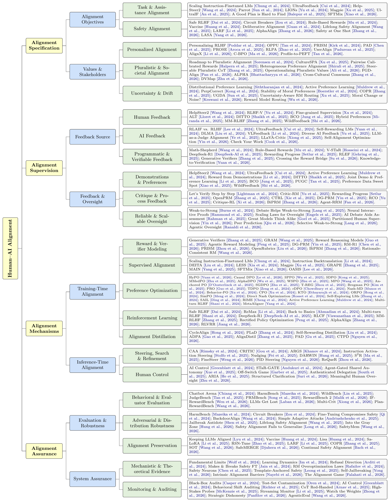

# Awesome Human–AI Alignment

A taxonomy-guided collection of research on specifying, supervising, implementing, and assuring Human–AI Alignment.

   

## News

- **2026-09-10:** Expanded the collection to 336 unique works and synchronized all 23 branches with the revised taxonomy.
- **2026-09-09:** Released the first public taxonomy and paper collection.

## Overview

This repository supports an ongoing survey of **Human–AI Alignment**. The organization follows the complete alignment pipeline: what the system should align to, how feedback and oversight communicate those requirements, how training and inference mechanisms shape behavior, and how alignment claims are evaluated and maintained.

The branches are intentionally non-exclusive. A paper can appear in several places when it contributes to more than one alignment question. The compact figure emphasizes recent and representative work from 2023 onward; the collection below also retains foundational papers and maps every citation key in the bibliography.

## Taxonomy

  

[View the high-resolution PDF](./Figure/Taxonomy.pdf) · [Edit the taxonomy source](./Figure/Taxonomy.tex)

| Dimension | Guiding question | Groups |
|---|---|---|
| **[Alignment Specification](#alignment-specification)** | What should an AI system align to, and whose objectives and values should count? | [Alignment Objectives](#alignment-objectives) · [Values & Stakeholders](#values-stakeholders) |
| **[Alignment Supervision](#alignment-supervision)** | Where do alignment signals come from, and how are they expressed and scaled? | [Feedback Source](#feedback-source) · [Feedback & Oversight](#feedback-oversight) |
| **[Alignment Mechanisms](#alignment-mechanisms)** | How are alignment signals translated into model behavior during training and inference? | [Training-Time Alignment](#training-time-alignment) · [Inference-Time Alignment](#inference-time-alignment) |
| **[Alignment Assurance](#alignment-assurance)** | How do we evaluate, stress-test, preserve, interpret, and monitor alignment? | [Evaluation & Robustness](#evaluation-robustness) · [System Assurance](#system-assurance) |

### Collection coverage

- **238 figure assignments** covering **208 unique citation keys**.
- **464 collection assignments** across 23 terminal branches; repeated placement is intentional.
- **338 BibTeX records**, **337 unique citation keys**, and **336 unique normalized titles**.
- **6 cross-cutting surveys** are listed separately after the branch collection.

### Cross-cutting descriptors

- **System and modality:** text, multimodal, agentic, and embodied systems.
- **Feedback granularity:** response, span, reasoning step, token, and action.
- **Optimization granularity:** sequence, segment, token, and trajectory.
- **Learning regime:** offline, online, static, and continual learning.

Feedback granularity and optimization granularity are tracked separately because the unit receiving feedback can differ from the unit optimized by the learning objective.

## Paper collection

Papers are sorted by year within each branch. Each entry links to the publication page, DOI, arXiv record, or a clearly labeled Scholar search when the BibTeX record has no direct link.

## Alignment Specification

*What should an AI system align to, and whose objectives and values should count?*

| Group | Branch | Papers |
|---|---|---:|
| Alignment Objectives | [Task & Assistance Alignment](#task-assistance-alignment) | 27 |
| Alignment Objectives | [Safety Alignment](#safety-alignment) | 17 |
| Values & Stakeholders | [Personalized Alignment](#personalized-alignment) | 14 |
| Values & Stakeholders | [Pluralistic & Societal Alignment](#pluralistic-societal-alignment) | 25 |
| Values & Stakeholders | [Uncertainty & Drift](#uncertainty-drift) | 15 |

### Alignment Objectives

#### Task & Assistance Alignment (27)

- **2026** · [SFTMix: Elevating Language Model Instruction Tuning with Mixup Recipe](https://aclanthology.org/2026.acl-long.78/) — Xiao et al. · `xiao2026sftmix` · Paper
- **2025** · [A Good Plan is Hard to Find: Aligning Models with Preferences is Misaligned with What Helps Users](https://aclanthology.org/2025.emnlp-main.585/) — Balepur et al. · `balepur2025goodplan` · Paper
- **2025** · [Magpie: Alignment Data Synthesis from Scratch by Prompting Aligned LLMs with Nothing](https://proceedings.iclr.cc/paper_files/paper/2025/hash/be06e3802e9411381feece79b4d960c1-Abstract-Conference.html) — Xu et al. · `xu2025magpie` · Paper
- **2025** · [UltraIF: Advancing Instruction Following from the Wild](https://aclanthology.org/2025.emnlp-main.945/) — An et al. · `an2025ultraif` · Paper
- **2024** · [Aligning Large Multimodal Models with Factually Augmented RLHF](https://aclanthology.org/2024.findings-acl.775/) — Sun et al. · `sun2024factrlhf` · Paper
- **2024** · [HelpSteer 2: Open-source Dataset for Training Top-Performing Reward Models](https://doi.org/10.52202/079017-0047) — Wang et al. · `wang2024helpsteer2` · DOI
- **2024** · [LIONs: An Empirically Optimized Approach to Align Language Models](https://aclanthology.org/2024.emnlp-main.496/) — Yu et al. · `yu2024lions` · Paper
- **2024** · [Parrot: Enhancing Multi-Turn Instruction Following for Large Language Models](https://aclanthology.org/2024.acl-long.525/) — Sun et al. · `sun2024parrot` · Paper
- **2024** · [RAGTruth: A Hallucination Corpus for Developing Trustworthy Retrieval-Augmented Language Models](https://aclanthology.org/2024.acl-long.585/) — Niu et al. · `niu2024ragtruth` · Paper
- **2024** · [Scaling Instruction-Finetuned Language Models](https://www.jmlr.org/papers/v25/23-0870.html) — Chung et al. · `chung2024flan` · Paper
- **2024** · [UltraFeedback: Boosting Language Models with Scaled AI Feedback](https://proceedings.mlr.press/v235/cui24f.html) — Cui et al. · `cui2024ultrafeedback` · Paper
- **2023** · [Direct Preference Optimization: Your Language Model Is Secretly a Reward Model](https://proceedings.neurips.cc/paper_files/paper/2023/hash/a85b405ed65c6477a4fe8302b5e06ce7-Abstract-Conference.html) — Rafailov et al. · `rafailov2023dpo` · Paper
- **2023** · [Enabling Large Language Models to Generate Text with Citations](https://aclanthology.org/2023.emnlp-main.398/) — Gao et al. · `gao2023citations` · Paper
- **2023** · [Fine-Grained Human Feedback Gives Better Rewards for Language Model Training](https://proceedings.neurips.cc/paper_files/paper/2023/hash/b8c90b65739ae8417e61eadb521f63d5-Abstract.html) — Wu et al. · `wu2023finegrained` · Paper
- **2023** · [LIMA: Less Is More for Alignment](https://papers.neurips.cc/paper_files/paper/2023/hash/ac662d74829e4407ce1d126477f4a03a-Abstract-Conference.html) — Zhou et al. · `zhou2023lima` · Paper
- **2023** · [Self-Instruct: Aligning Language Models with Self-Generated Instructions](https://aclanthology.org/2023.acl-long.754/) — Wang et al. · `wang2023selfinstruct` · Paper
- **2023** · [SteerLM: Attribute Conditioned SFT as an (User-Steerable) Alternative to RLHF](https://aclanthology.org/2023.findings-emnlp.754/) — Dong et al. · `dong2023steerlm` · Paper
- **2023** · [The Flan Collection: Designing Data and Methods for Effective Instruction Tuning](https://proceedings.mlr.press/v202/longpre23a.html) — Longpre et al. · `longpre2023flancollection` · Paper
- **2022** · [Cross-Task Generalization via Natural Language Crowdsourcing Instructions](https://aclanthology.org/2022.acl-long.244/) — Mishra et al. · `mishra2022natural` · Paper
- **2022** · [Finetuned Language Models Are Zero-Shot Learners](https://research.google/pubs/finetuned-language-models-are-zero-shot-learners/) — Wei et al. · `wei2022flan` · Paper
- **2022** · [Improving Alignment of Dialogue Agents via Targeted Human Judgements](https://arxiv.org/abs/2209.14375) — Glaese et al. · `glaese2022sparrow` · Paper
- **2022** · [Multitask Prompted Training Enables Zero-Shot Task Generalization](https://arxiv.org/abs/2110.08207) — Sanh et al. · `sanh2022t0` · Paper
- **2022** · [Super-NaturalInstructions: Generalization via Declarative Instructions on 1600+ NLP Tasks](https://aclanthology.org/2022.emnlp-main.340/) — Wang et al. · `wang2022superni` · Paper
- **2022** · [Training a Helpful and Harmless Assistant with Reinforcement Learning from Human Feedback](https://arxiv.org/abs/2204.05862) — Bai et al. · `bai2022hh` · Paper
- **2022** · [Training Language Models to Follow Instructions with Human Feedback](https://proceedings.neurips.cc/paper_files/paper/2022/hash/b1efde53be364a73914f58805a001731-Abstract.html) — Ouyang et al. · `ouyang2022instructgpt` · Paper
- **2021** · [A General Language Assistant as a Laboratory for Alignment](https://arxiv.org/abs/2112.00861) — Askell et al. · `askell2021assistant` · Paper
- **2021** · [WebGPT: Browser-Assisted Question-Answering with Human Feedback](https://arxiv.org/abs/2112.09332) — Nakano et al. · `nakano2021webgpt` · Paper

#### Safety Alignment (17)

- **2026** · [AlphaAlign: Incentivizing Safety Alignment with Extremely Simplified Reinforcement Learning](https://iclr.cc/virtual/2026/poster/10011731) — Zhang et al. · `zhang2026alphaalign` · Paper
- **2026** · [LASA: Language-Agnostic Semantic Alignment at the Semantic Bottleneck for LLM Safety](https://aclanthology.org/2026.acl-long.1913/) — Yang et al. · `yang2026lasa` · Paper
- **2026** · [Mitigating the Safety Alignment Tax with Null-Space Constrained Policy Optimization](https://proceedings.iclr.cc/paper_files/paper/2026/hash/e664650506f1cf2b4696df892147c06e-Abstract-Conference.html) — Niu et al. · `niu2026nspo` · Paper
- **2026** · [Safety at One Shot: Patching Fine-Tuned LLMs with A Single Instance](https://proceedings.iclr.cc/paper_files/paper/2026/hash/3d7cb780442f0d17c844dbe34997fab7-Abstract-Conference.html) — Zhang et al. · `zhang2026safetyoneshot` · Paper
- **2025** · [Alignment of Large Language Models with Constrained Learning](https://proceedings.nips.cc/paper_files/paper/2025/hash/2c9b48ed0dd0252ea3ea14182956341b-Abstract-Conference.html) — Zhang et al. · `zhang2025constrainedalignment` · Paper
- **2025** · [Antidote: Post-fine-tuning Safety Alignment for Large Language Models against Harmful Fine-tuning Attack](https://proceedings.mlr.press/v267/huang25b.html) — Huang et al. · `huang2025antidote` · Paper
- **2025** · [Layer-Aware Representation Filtering: Purifying Finetuning Data to Preserve LLM Safety Alignment](https://aclanthology.org/2025.emnlp-main.406/) — Li et al. · `li2025larf` · Paper
- **2025** · [Lifelong Safety Alignment for Language Models](https://proceedings.neurips.cc/paper_files/paper/2025/hash/1ca2f4528792b31eab7a3e7f6a1c130b-Abstract-Conference.html) — Wang et al. · `wang2025lifelong` · Paper
- **2024** · [Deliberative Alignment: Reasoning Enables Safer Language Models](https://arxiv.org/abs/2412.16339) — Guan et al. · `guan2024deliberative` · Paper
- **2024** · [Improving Alignment and Robustness with Circuit Breakers](https://proceedings.neurips.cc/paper_files/paper/2024/hash/97ca7168c2c333df5ea61ece3b3276e1-Abstract-Conference.html) — Zou et al. · `zou2024circuitbreakers` · Paper
- **2024** · [Rule Based Rewards for Language Model Safety](https://scholar.google.com/scholar?q=Rule+Based+Rewards+for+Language+Model+Safety) — Mu et al. · `mu2024rulebased` · Scholar
- **2024** · [Safe RLHF: Safe Reinforcement Learning from Human Feedback](https://proceedings.iclr.cc/paper_files/paper/2024/hash/dd1577afd396928ed64216f3f1fd5556-Abstract-Conference.html) — Dai et al. · `dai2024saferlhf` · Paper
- **2024** · [Vaccine: Perturbation-aware Alignment for Large Language Models against Harmful Fine-tuning Attack](https://proceedings.neurips.cc/paper_files/paper/2024/hash/873c86d9a979ab80d8e2919510d4446b-Abstract-Conference.html) — Huang et al. · `huang2024vaccine` · Paper
- **2023** · [BeaverTails: Towards Improved Safety Alignment of LLM via a Human-Preference Dataset](https://proceedings.neurips.cc/paper_files/paper/2023/hash/4dbb61cb68671edc4ca3712d70083b9f-Abstract.html) — Ji et al. · `ji2023beavertails` · Paper
- **2022** · [Constitutional AI: Harmlessness from AI Feedback](https://arxiv.org/abs/2212.08073) — Bai et al. · `bai2022constitutional` · Paper
- **2022** · [Training a Helpful and Harmless Assistant with Reinforcement Learning from Human Feedback](https://arxiv.org/abs/2204.05862) — Bai et al. · `bai2022hh` · Paper
- **2021** · [A General Language Assistant as a Laboratory for Alignment](https://arxiv.org/abs/2112.00861) — Askell et al. · `askell2021assistant` · Paper

### Values & Stakeholders

#### Personalized Alignment (14)

- **2026** · [From 1,000,000 Users to Every User: Scaling Up Personalized Preference for User-level Alignment](https://aclanthology.org/2026.acl-long.1391/) — Li et al. · `li2026alignx` · Paper
- **2026** · [Instant Personalized Large Language Model Adaptation via Hypernetwork](https://aclanthology.org/2026.acl-long.1081/) — Tan et al. · `tan2026profilepeft` · Paper
- **2026** · [Personalizing LLMs with Binary Feedback: A Preference-Calibrated Optimization Framework](https://aclanthology.org/2026.acl-long.1222/) — Ma et al. · `ma2026cbpo` · Paper
- **2025** · [A Survey on Personalized Alignment—The Missing Piece for Large Language Models in Real-World Applications](https://aclanthology.org/2025.findings-acl.277/) — Guan et al. · `guan2025personalizedsurvey` · Paper
- **2025** · [Aligning LLMs by Predicting Preferences from User Writing Samples](https://proceedings.mlr.press/v267/aroca-ouellette25a.html) — Aroca-Ouellette et al. · `aroca2025prose` · Paper
- **2025** · [Inference-Time Personalized Alignment with a Few User Preference Queries](https://proceedings.nips.cc/paper_files/paper/2025/hash/7ace822623d2313ec017df71c3a90286-Abstract-Conference.html) — Pădurean et al. · `padurean2025useralign` · Paper
- **2025** · [PAD: Personalized Alignment of LLMs at Decoding-time](https://proceedings.iclr.cc/paper_files/paper/2025/hash/196c8da9209b1977408d8771c4e7ee56-Abstract-Conference.html) — Chen et al. · `chen2025pad` · Paper
- **2025** · [Persona-judge: Personalized Alignment of Large Language Models via Token-level Self-judgment](https://aclanthology.org/2025.findings-acl.260/) — Zhang et al. · `zhang2025personajudge` · Paper
- **2025** · [Teaching Language Models to Evolve with Users: Dynamic Profile Modeling for Personalized Alignment](https://proceedings.neurips.cc/paper_files/paper/2025/hash/2fbc1ea60e215275e823c86338417162-Abstract-Conference.html) — Zhao et al. · `zhao2025rlpa` · Paper
- **2024** · [Democratizing Large Language Models via Personalized Parameter-Efficient Fine-tuning](https://aclanthology.org/2024.emnlp-main.372/) — Tan et al. · `tan2024oppu` · Paper
- **2024** · [Personalized Language Modeling from Personalized Human Feedback](https://arxiv.org/abs/2402.05133) — Li et al. · `li2024personalized` · Paper
- **2024** · [Personalizing Reinforcement Learning from Human Feedback](https://proceedings.neurips.cc/paper_files/paper/2024/hash/5e1c255653eb98cef13f45b2d337c882-Abstract-Conference.html) — Poddar et al. · `poddar2024personalizing` · Paper
- **2024** · [The PRISM Alignment Dataset: What Participatory, Representative and Individualised Human Feedback Reveals About the Subjective and Multicultural Alignment of Large Language Models](https://proceedings.neurips.cc/paper_files/paper/2024/hash/be2e1b68b44f2419e19f6c35a1b8cf35-Abstract-Datasets_and_Benchmarks_Track.html) — Kirk et al. · `kirk2024prism` · Paper
- **2023** · [Personalized Soups: Personalized Large Language Model Alignment via Post-hoc Parameter Merging](https://arxiv.org/abs/2310.11564) — Jang et al. · `jang2023personalizedsoups` · Paper

#### Pluralistic & Societal Alignment (25)

- **2026** · [A Game-Theoretic Negotiation Framework for Cross-Cultural Consensus](https://aclanthology.org/2026.acl-long.49/) — Zhang et al. · `zhang2026crosscultural` · Paper
- **2026** · [ALPHA: Action-Based Learning for Pluralistic Human Alignment in Large Language Models](https://doi.org/10.1609/aaai.v40i44.41056) — Bhattacharyya et al. · `bhattacharyya2026alpha` · DOI
- **2026** · [DVMap: Fine-Grained Pluralistic Value Alignment via High-Consensus Demographic-Value Mapping](https://aclanthology.org/2026.acl-long.909/) — Zhu et al. · `zhu2026dvmap` · Paper
- **2026** · [FGD-Align: Pluralistic Alignment for Large Language Models via Fuzzy Group Decision-Making](https://doi.org/10.1609/aaai.v40i21.38819) — Pan et al. · `pan2026fgdalign` · DOI
- **2026** · [Mind the Gap in Cultural Alignment: Task-Aware Culture Management for Large Language Models](https://aclanthology.org/2026.acl-long.766/) — Zhang et al. · `zhang2026culturemanager` · Paper
- **2026** · [Operationalizing Pluralistic Values in Large Language Model Alignment Reveals Trade-offs in Safety, Inclusivity, and Model Behavior](https://doi.org/10.1609/aaai.v40i44.41053) — Ali et al. · `ali2026pluralistic` · DOI
- **2025** · [Aligning Trustworthy AI with Democracy: A Dual Taxonomy of Opportunities and Risks](https://arxiv.org/abs/2505.13565) — Mentxaka et al. · `mentxaka2025democracy` · Paper
- **2025** · [Direct Alignment with Heterogeneous Preferences](https://doi.org/10.52202/085713-2350) — Shirali et al. · `shirali2025heterogeneous` · DOI
- **2025** · [Exploring Chain-of-Thought Reasoning for Steerable Pluralistic Alignment](https://aclanthology.org/2025.emnlp-main.1301/) — Zhang et al. · `zhang2025pluralisticcot` · Paper
- **2025** · [Multiple LLM Agents Debate for Equitable Cultural Alignment](https://aclanthology.org/2025.acl-long.1210/) — Ki et al. · `ki2025culturaldebate` · Paper
- **2025** · [Pairwise Calibrated Rewards for Pluralistic Alignment](https://papers.neurips.cc/paper_files/paper/2025/hash/53dbd7e34fab703a639964e2d3ee9e84-Abstract-Conference.html) — Halpern et al. · `halpern2025pairwise` · Paper
- **2025** · [Self-Pluralising Culture Alignment for Large Language Models](https://aclanthology.org/2025.naacl-long.350/) — Xu et al. · `xu2025culturespa` · Paper
- **2025** · [Steerable Pluralism: Pluralistic Alignment via Few-Shot Comparative Regression](https://doi.org/10.1609/aies.v8i1.36527) — Adams et al. · `adams2025steerable` · DOI
- **2024** · [AI Control: Improving Safety Despite Intentional Subversion](https://proceedings.mlr.press/v235/greenblatt24a.html) — Greenblatt et al. · `greenblatt2024control` · Paper
- **2024** · [Collective Constitutional AI: Aligning a Language Model with Public Input](https://arxiv.org/abs/2406.07814) — Huang et al. · `huang2024collective` · Paper
- **2024** · [CultureLLM: Incorporating Cultural Differences into Large Language Models](https://proceedings.neurips.cc/paper_files/paper/2024/hash/9a16935bf54c4af233e25d998b7f4a2c-Abstract-Conference.html) — Li et al. · `li2024culturellm` · Paper
- **2024** · [Distributional Preference Learning: Understanding and Accounting for Hidden Context in RLHF](https://scholar.google.com/scholar?q=Distributional+Preference+Learning%3A+Understanding+and+Accounting+for+Hidden+Context+in+RLHF) — Siththaranjan et al. · `siththaranjan2024distributional` · Scholar
- **2024** · [Modular Pluralism: Pluralistic Alignment via Multi-LLM Collaboration](https://aclanthology.org/2024.emnlp-main.240/) — Feng et al. · `feng2024modular` · Paper
- **2024** · [Position: A Roadmap to Pluralistic Alignment](https://scholar.google.com/scholar?q=Position%3A+A+Roadmap+to+Pluralistic+Alignment) — Sorensen et al. · `sorensen2024pluralistic` · Scholar
- **2024** · [Position: Social Choice Should Guide AI Alignment in Dealing with Diverse Human Feedback](https://proceedings.mlr.press/v235/conitzer24a.html) — Conitzer et al. · `conitzer2024socialchoice` · Paper
- **2024** · [Rule Based Rewards for Language Model Safety](https://scholar.google.com/scholar?q=Rule+Based+Rewards+for+Language+Model+Safety) — Mu et al. · `mu2024rulebased` · Scholar
- **2024** · [The PRISM Alignment Dataset: What Participatory, Representative and Individualised Human Feedback Reveals About the Subjective and Multicultural Alignment of Large Language Models](https://proceedings.neurips.cc/paper_files/paper/2024/hash/be2e1b68b44f2419e19f6c35a1b8cf35-Abstract-Datasets_and_Benchmarks_Track.html) — Kirk et al. · `kirk2024prism` · Paper
- **2022** · [Constitutional AI: Harmlessness from AI Feedback](https://arxiv.org/abs/2212.08073) — Bai et al. · `bai2022constitutional` · Paper
- **2022** · [Fine-Tuning Language Models to Find Agreement among Humans with Diverse Preferences](https://proceedings.neurips.cc/paper/2022/hash/f978c8f3b5f399cae464e85f72e28503-Abstract-Conference.html) — Bakker et al. · `bakker2022finetuning` · Paper
- **2018** · [The Moral Machine Experiment](https://doi.org/10.1038/s41586-018-0637-6) — Awad et al. · `awad2018moral` · DOI

#### Uncertainty & Drift (15)

- **2026** · [Moral Change or Noise? On Problems of Aligning AI with Temporally Unstable Human Feedback](https://ojs.aaai.org/index.php/AAAI/article/view/41083) — Keswani et al. · `keswani2026moralchange` · Paper
- **2026** · [Reward Model Routing in Alignment](https://proceedings.iclr.cc/paper_files/paper/2026/hash/8dc9b0192713f44f035b8c0bd3f4153a-Abstract-Conference.html) — Wu et al. · `wu2026rmrouting` · Paper
- **2025** · [Ask a Strong LLM Judge when Your Reward Model is Uncertain](https://proceedings.neurips.cc/paper_files/paper/2025/hash/6c312cf14321a99ae3788a41593cf2bd-Abstract-Conference.html) — Xu et al. · `xu2025uncertaintyjudge` · Paper
- **2025** · [COPR: Continual Human Preference Learning via Optimal Policy Regularization](https://aclanthology.org/2025.findings-acl.281/) — Zhang et al. · `zhang2025copr` · Paper
- **2025** · [Lifelong Safety Alignment for Language Models](https://proceedings.neurips.cc/paper_files/paper/2025/hash/1ca2f4528792b31eab7a3e7f6a1c130b-Abstract-Conference.html) — Wang et al. · `wang2025lifelong` · Paper
- **2025** · [Uncertainty and Influence aware Reward Model Refinement for Reinforcement Learning from Human Feedback](https://proceedings.iclr.cc/paper_files/paper/2025/hash/fd7259e22add6de6df8ff0ccc902a34d-Abstract-Conference.html) — Sun et al. · `sun2025ugda` · Paper
- **2024** · [Active Preference Learning for Large Language Models](https://scholar.google.com/scholar?q=Active+Preference+Learning+for+Large+Language+Models) — Muldrew et al. · `muldrew2024active` · Scholar
- **2024** · [Distributional Preference Learning: Understanding and Accounting for Hidden Context in RLHF](https://scholar.google.com/scholar?q=Distributional+Preference+Learning%3A+Understanding+and+Accounting+for+Hidden+Context+in+RLHF) — Siththaranjan et al. · `siththaranjan2024distributional` · Scholar
- **2024** · [On The Stability of Moral Preferences: A Problem with Computational Elicitation Methods](https://ojs.aaai.org/index.php/AIES/article/view/31626) — Boerstler et al. · `boerstler2024stability` · Paper
- **2024** · [Perplexity-aware Correction for Robust Alignment with Noisy Preferences](https://proceedings.neurips.cc/paper_files/paper/2024/hash/31a57804448363bcab777f818f75f5b4-Abstract-Conference.html) — Kong et al. · `kong2024perpcorrect` · Paper
- **2017** · [Inverse Reward Design](https://scholar.google.com/scholar?q=Inverse+Reward+Design) — Hadfield-Menell et al. · `hadfieldmenell2017ird` · Scholar
- **2017** · [The Off-Switch Game](https://doi.org/10.24963/ijcai.2017/32) — Hadfield-Menell et al. · `hadfieldmenell2017offswitch` · DOI
- **2016** · [Cooperative Inverse Reinforcement Learning](https://scholar.google.com/scholar?q=Cooperative+Inverse+Reinforcement+Learning) — Hadfield-Menell et al. · `hadfieldmenell2016cirl` · Scholar
- **2004** · [Apprenticeship Learning via Inverse Reinforcement Learning](https://scholar.google.com/scholar?q=Apprenticeship+Learning+via+Inverse+Reinforcement+Learning) — Abbeel et al. · `abbeel2004apprenticeship` · Scholar
- **2000** · [Algorithms for Inverse Reinforcement Learning](https://scholar.google.com/scholar?q=Algorithms+for+Inverse+Reinforcement+Learning) — Ng et al. · `ng2000irl` · Scholar

## Alignment Supervision

*Where do alignment signals come from, and how are they expressed and scaled?*

| Group | Branch | Papers |
|---|---|---:|
| Feedback Source | [Human Feedback](#human-feedback) | 17 |
| Feedback Source | [AI Feedback](#ai-feedback) | 11 |
| Feedback Source | [Programmatic & Verifiable Feedback](#programmatic-verifiable-feedback) | 10 |
| Feedback & Oversight | [Demonstrations & Preferences](#demonstrations-preferences) | 21 |
| Feedback & Oversight | [Critique & Process Feedback](#critique-process-feedback) | 19 |
| Feedback & Oversight | [Reliable & Scalable Oversight](#reliable-scalable-oversight) | 25 |

### Feedback Source

#### Human Feedback (17)

- **2026** · [WildFeedback: Aligning LLMs With In-situ User Interactions And Feedback](https://aclanthology.org/2026.acl-long.1701/) — Shi et al. · `shi2026wildfeedback` · Paper
- **2025** · [Aligning Language Models with Demonstrated Feedback](https://proceedings.iclr.cc/paper_files/paper/2025/hash/349a45f211fb1b3850da1ccd829e869e-Abstract-Conference.html) — Shaikh et al. · `shaikh2025ditto` · Paper
- **2025** · [Binary Classifier Optimization for Large Language Model Alignment](https://aclanthology.org/2025.acl-long.93/) — Jung et al. · `jung2025bco` · Paper
- **2025** · [Hybrid Preferences: Learning to Route Instances for Human vs. AI Feedback](https://aclanthology.org/2025.acl-long.355/) — Miranda et al. · `miranda2025hybrid` · Paper
- **2025** · [MM-RLHF: The Next Step Forward in Multimodal LLM Alignment](https://icml.cc/virtual/2025/poster/45124) — Zhang et al. · `zhang2025mmrlhf` · Paper
- **2024** · [Aligning Large Language Models via Fine-grained Supervision](https://aclanthology.org/2024.acl-short.62/) — Xu et al. · `xu2024finegrained` · Paper
- **2024** · [ChatGLM-RLHF: Practices of Aligning Large Language Models with Human Feedback](https://arxiv.org/abs/2404.00934) — Hou et al. · `hou2024chatglmrlhf` · Paper
- **2024** · [HelpSteer 2: Open-source Dataset for Training Top-Performing Reward Models](https://doi.org/10.52202/079017-0047) — Wang et al. · `wang2024helpsteer2` · DOI
- **2024** · [RLHF-V: Towards Trustworthy MLLMs via Behavior Alignment from Fine-Grained Correctional Human Feedback](https://openaccess.thecvf.com/content/CVPR2024/html/Yu_RLHF-V_Towards_Trustworthy_MLLMs_via_Behavior_Alignment_from_Fine-grained_Correctional_CVPR_2024_paper.html) — Yu et al. · `yu2024rlhfv` · Paper
- **2024** · [Towards Aligning Language Models with Textual Feedback](https://aclanthology.org/2024.emnlp-main.1129/) — Lloret et al. · `lloret2024alt` · Paper
- **2023** · [Fine-Grained Human Feedback Gives Better Rewards for Language Model Training](https://proceedings.neurips.cc/paper_files/paper/2023/hash/b8c90b65739ae8417e61eadb521f63d5-Abstract.html) — Wu et al. · `wu2023finegrained` · Paper
- **2022** · [Improving Alignment of Dialogue Agents via Targeted Human Judgements](https://arxiv.org/abs/2209.14375) — Glaese et al. · `glaese2022sparrow` · Paper
- **2022** · [Training a Helpful and Harmless Assistant with Reinforcement Learning from Human Feedback](https://arxiv.org/abs/2204.05862) — Bai et al. · `bai2022hh` · Paper
- **2022** · [Training Language Models to Follow Instructions with Human Feedback](https://proceedings.neurips.cc/paper_files/paper/2022/hash/b1efde53be364a73914f58805a001731-Abstract.html) — Ouyang et al. · `ouyang2022instructgpt` · Paper
- **2020** · [Learning to Summarize with Human Feedback](https://proceedings.neurips.cc/paper/2020/hash/1f89885d556929e98d3ef9b86448f951-Abstract.html) — Stiennon et al. · `stiennon2020summarize` · Paper
- **2019** · [Fine-Tuning Language Models from Human Preferences](https://arxiv.org/abs/1909.08593) — Ziegler et al. · `ziegler2019finetuning` · Paper
- **2017** · [Deep Reinforcement Learning from Human Preferences](https://proceedings.neurips.cc/paper/2017/hash/d5e2c0adad503c91f91df240d0cd4e49-Abstract.html) — Christiano et al. · `christiano2017preferences` · Paper

#### AI Feedback (11)

- **2026** · [Aligning Large Language Models via Fully Self-Synthetic Data](https://aclanthology.org/2026.acl-long.1595/) — Yin et al. · `yin2026sao` · Paper
- **2026** · [Check Your Work: Structured Checklist Feedback for Improving Large Language Models](https://aclanthology.org/2026.acl-long.759/) — Cook et al. · `cook2026checklist` · Paper
- **2025** · [Diverse AI Feedback For Large Language Model Alignment](https://aclanthology.org/2025.tacl-1.19/) — Yu et al. · `yu2025daif` · Paper
- **2025** · [Learning LLM-as-a-Judge for Preference Alignment](https://proceedings.iclr.cc/paper_files/paper/2025/hash/09fd990b19b2e69cc4d20e9969e43f09-Abstract-Conference.html) — Ye et al. · `ye2025conj` · Paper
- **2025** · [LLaVA-Critic: Learning to Evaluate Multimodal Models](https://doi.org/10.1109/CVPR52734.2025.01271) — Xiong et al. · `xiong2025llavacritic` · DOI
- **2024** · [Direct Large Language Model Alignment Through Self-Rewarding Contrastive Prompt Distillation](https://aclanthology.org/2024.acl-long.523/) — Liu et al. · `liu2024dlma` · Paper
- **2024** · [RLAIF vs. RLHF: Scaling Reinforcement Learning from Human Feedback with AI Feedback](https://proceedings.mlr.press/v235/lee24t.html) — Lee et al. · `lee2024rlaif` · Paper
- **2024** · [Self-Rewarding Language Models](https://scholar.google.com/scholar?q=Self-Rewarding+Language+Models) — Yuan et al. · `yuan2024selfrewarding` · Scholar
- **2024** · [UltraFeedback: Boosting Language Models with Scaled AI Feedback](https://proceedings.mlr.press/v235/cui24f.html) — Cui et al. · `cui2024ultrafeedback` · Paper
- **2024** · [VLFeedback: A Large-Scale AI Feedback Dataset for Large Vision-Language Models Alignment](https://aclanthology.org/2024.emnlp-main.358/) — Li et al. · `li2024vlfeedback` · Paper
- **2022** · [Constitutional AI: Harmlessness from AI Feedback](https://arxiv.org/abs/2212.08073) — Bai et al. · `bai2022constitutional` · Paper

#### Programmatic & Verifiable Feedback (10)

- **2026** · [Crossing the Reward Bridge: Expanding Reinforcement Learning with Verifiable Rewards Across Diverse Domains](https://aclanthology.org/2026.acl-long.178/) — Su et al. · `su2026rewardbridge` · Paper
- **2026** · [Knowledge-to-Verification: Exploring RLVR for LLMs in Knowledge-Intensive Domains](https://aclanthology.org/2026.acl-long.1891/) — Yuan et al. · `yuan2026k2v` · Paper
- **2025** · [DeepSeek-R1: Incentivizing Reasoning Capability in LLMs via Reinforcement Learning](https://arxiv.org/abs/2501.12948) — DeepSeek-AI · `deepseek2025r1` · Paper
- **2025** · [Generative Verifiers: Reward Modeling as Next-Token Prediction](https://proceedings.iclr.cc/paper_files/paper/2025/hash/214308a2d5e3f83ef9ad2739e1cbc46d-Abstract-Conference.html) — Zhang et al. · `zhang2025genrm` · Paper
- **2025** · [Rewarding Progress: Scaling Automated Process Verifiers for LLM Reasoning](https://proceedings.iclr.cc/paper_files/paper/2025/hash/98711dea460bdefe0e651ca23ec98ba2-Abstract-Conference.html) — Setlur et al. · `setlur2025rewarding` · Paper
- **2025** · [RLEF: Grounding Code LLMs in Execution Feedback with Reinforcement Learning](https://proceedings.mlr.press/v267/gehring25a.html) — Gehring et al. · `gehring2025rlef` · Paper
- **2024** · [DeepSeekMath: Pushing the Limits of Mathematical Reasoning in Open Language Models](https://arxiv.org/abs/2402.03300) — Shao et al. · `shao2024deepseekmath` · Paper
- **2024** · [Math-Shepherd: Verify and Reinforce LLMs Step-by-Step without Human Annotations](https://aclanthology.org/2024.acl-long.510/) — Wang et al. · `wang2024mathshepherd` · Paper
- **2024** · [Rule Based Rewards for Language Model Safety](https://scholar.google.com/scholar?q=Rule+Based+Rewards+for+Language+Model+Safety) — Mu et al. · `mu2024rulebased` · Scholar
- **2024** · [V-STaR: Training Verifiers for Self-Taught Reasoners](https://openreview.net/forum?id=stmqBSW2dV) — Hosseini et al. · `hosseini2024vstar` · Paper

### Feedback & Oversight

#### Demonstrations & Preferences (21)

- **2026** · [WildFeedback: Aligning LLMs With In-situ User Interactions And Feedback](https://aclanthology.org/2026.acl-long.1701/) — Shi et al. · `shi2026wildfeedback` · Paper
- **2025** · [Aligning Language Models with Demonstrated Feedback](https://proceedings.iclr.cc/paper_files/paper/2025/hash/349a45f211fb1b3850da1ccd829e869e-Abstract-Conference.html) — Shaikh et al. · `shaikh2025ditto` · Paper
- **2025** · [Aligning Large Language Models with Implicit Preferences from User-Generated Content](https://aclanthology.org/2025.acl-long.384/) — Tan et al. · `tan2025pugc` · Paper
- **2025** · [Binary Classifier Optimization for Large Language Model Alignment](https://aclanthology.org/2025.acl-long.93/) — Jung et al. · `jung2025bco` · Paper
- **2025** · [Finding the Sweet Spot: Preference Data Construction for Scaling Preference Optimization](https://aclanthology.org/2025.acl-long.615/) — Xiao et al. · `xiao2025sweetspot` · Paper
- **2025** · [Joint Reward and Policy Learning with Demonstrations and Human Feedback Improves Alignment](https://proceedings.iclr.cc/paper_files/paper/2025/hash/0ad6ebd11593822b8a6d5873ca9c5b0b-Abstract-Conference.html) — Li et al. · `li2025joint` · Paper
- **2024** · [Active Preference Learning for Large Language Models](https://scholar.google.com/scholar?q=Active+Preference+Learning+for+Large+Language+Models) — Muldrew et al. · `muldrew2024active` · Scholar
- **2024** · [Getting More Juice Out of the SFT Data: Reward Learning from Human Demonstration Improves SFT for LLM Alignment](https://papers.nips.cc/paper_files/paper/2024/hash/e0c9b65fb3e41aaa86576df3ec33ad2e-Abstract-Conference.html) — Li et al. · `li2024demoreward` · Paper
- **2024** · [HelpSteer 2: Open-source Dataset for Training Top-Performing Reward Models](https://doi.org/10.52202/079017-0047) — Wang et al. · `wang2024helpsteer2` · DOI
- **2024** · [RLHF-V: Towards Trustworthy MLLMs via Behavior Alignment from Fine-Grained Correctional Human Feedback](https://openaccess.thecvf.com/content/CVPR2024/html/Yu_RLHF-V_Towards_Trustworthy_MLLMs_via_Behavior_Alignment_from_Fine-grained_Correctional_CVPR_2024_paper.html) — Yu et al. · `yu2024rlhfv` · Paper
- **2024** · [UltraFeedback: Boosting Language Models with Scaled AI Feedback](https://proceedings.mlr.press/v235/cui24f.html) — Cui et al. · `cui2024ultrafeedback` · Paper
- **2023** · [Fine-Grained Human Feedback Gives Better Rewards for Language Model Training](https://proceedings.neurips.cc/paper_files/paper/2023/hash/b8c90b65739ae8417e61eadb521f63d5-Abstract.html) — Wu et al. · `wu2023finegrained` · Paper
- **2023** · [LIMA: Less Is More for Alignment](https://papers.neurips.cc/paper_files/paper/2023/hash/ac662d74829e4407ce1d126477f4a03a-Abstract-Conference.html) — Zhou et al. · `zhou2023lima` · Paper
- **2023** · [Self-Instruct: Aligning Language Models with Self-Generated Instructions](https://aclanthology.org/2023.acl-long.754/) — Wang et al. · `wang2023selfinstruct` · Paper
- **2023** · [The Flan Collection: Designing Data and Methods for Effective Instruction Tuning](https://proceedings.mlr.press/v202/longpre23a.html) — Longpre et al. · `longpre2023flancollection` · Paper
- **2022** · [Cross-Task Generalization via Natural Language Crowdsourcing Instructions](https://aclanthology.org/2022.acl-long.244/) — Mishra et al. · `mishra2022natural` · Paper
- **2022** · [Finetuned Language Models Are Zero-Shot Learners](https://research.google/pubs/finetuned-language-models-are-zero-shot-learners/) — Wei et al. · `wei2022flan` · Paper
- **2022** · [Super-NaturalInstructions: Generalization via Declarative Instructions on 1600+ NLP Tasks](https://aclanthology.org/2022.emnlp-main.340/) — Wang et al. · `wang2022superni` · Paper
- **2022** · [Training Language Models to Follow Instructions with Human Feedback](https://proceedings.neurips.cc/paper_files/paper/2022/hash/b1efde53be364a73914f58805a001731-Abstract.html) — Ouyang et al. · `ouyang2022instructgpt` · Paper
- **2020** · [Learning to Summarize with Human Feedback](https://proceedings.neurips.cc/paper/2020/hash/1f89885d556929e98d3ef9b86448f951-Abstract.html) — Stiennon et al. · `stiennon2020summarize` · Paper
- **2017** · [Deep Reinforcement Learning from Human Preferences](https://proceedings.neurips.cc/paper/2017/hash/d5e2c0adad503c91f91df240d0cd4e49-Abstract.html) — Christiano et al. · `christiano2017preferences` · Paper

#### Critique & Process Feedback (19)

- **2026** · [Critique-RL: Training Language Models for Critiquing Through Two-Stage Reinforcement Learning](https://proceedings.iclr.cc/paper_files/paper/2026/hash/d0e08f7a2d1b2d5c2da159395e8d61aa-Abstract-Conference.html) — Xi et al. · `xi2026critiquerl` · Paper
- **2026** · [Exploring Reasoning Reward Model for Agents](https://aclanthology.org/2026.findings-acl.95/) — Fan et al. · `fan2026agentrrm` · Paper
- **2026** · [The Bidirectional Process Reward Model](https://aclanthology.org/2026.acl-long.572/) — Zhang et al. · `zhang2026biprm` · Paper
- **2025** · [Dynamic and Generalizable Process Reward Modeling](https://aclanthology.org/2025.acl-long.212/) — Yin et al. · `yin2025dgprm` · Paper
- **2025** · [OpenPRM: Building Open-domain Process-based Reward Models with Preference Trees](https://scholar.google.com/scholar?q=OpenPRM%3A+Building+Open-domain+Process-based+Reward+Models+with+Preference+Trees) — Zhang et al. · `zhang2025openprm` · Scholar
- **2025** · [Rewarding Progress: Scaling Automated Process Verifiers for LLM Reasoning](https://proceedings.iclr.cc/paper_files/paper/2025/hash/98711dea460bdefe0e651ca23ec98ba2-Abstract-Conference.html) — Setlur et al. · `setlur2025rewarding` · Paper
- **2025** · [Self-Generated Critiques Boost Reward Modeling for Language Models](https://aclanthology.org/2025.naacl-long.573/) — Yu et al. · `yu2025criticrm` · Paper
- **2025** · [Teaching Language Models to Critique via Reinforcement Learning](https://proceedings.mlr.press/v267/xie25a.html) — Xie et al. · `xie2025ctrl` · Paper
- **2025** · [Training Language Model to Critique for Better Refinement](https://aclanthology.org/2025.findings-acl.1373/) — Yu et al. · `yu2025rco` · Paper
- **2024** · [CRITIC: Large Language Models Can Self-Correct with Tool-Interactive Critiquing](https://scholar.google.com/scholar?q=CRITIC%3A+Large+Language+Models+Can+Self-Correct+with+Tool-Interactive+Critiquing) — Gou et al. · `gou2024critic` · Scholar
- **2024** · [Let's Verify Step by Step](https://proceedings.iclr.cc/paper_files/paper/2024/hash/aca97732e30bcf1303bc22ac3924fd16-Abstract-Conference.html) — Lightman et al. · `lightman2024verify` · Paper
- **2024** · [LLM Critics Help Catch LLM Bugs](https://arxiv.org/abs/2407.00215) — McAleese et al. · `mcaleese2024critics` · Paper
- **2024** · [RLHF-V: Towards Trustworthy MLLMs via Behavior Alignment from Fine-Grained Correctional Human Feedback](https://openaccess.thecvf.com/content/CVPR2024/html/Yu_RLHF-V_Towards_Trustworthy_MLLMs_via_Behavior_Alignment_from_Fine-grained_Correctional_CVPR_2024_paper.html) — Yu et al. · `yu2024rlhfv` · Paper
- **2024** · [UltraFeedback: Boosting Language Models with Scaled AI Feedback](https://proceedings.mlr.press/v235/cui24f.html) — Cui et al. · `cui2024ultrafeedback` · Paper
- **2023** · [Fine-Grained Human Feedback Gives Better Rewards for Language Model Training](https://proceedings.neurips.cc/paper_files/paper/2023/hash/b8c90b65739ae8417e61eadb521f63d5-Abstract.html) — Wu et al. · `wu2023finegrained` · Paper
- **2023** · [Reflexion: Language Agents with Verbal Reinforcement Learning](https://scholar.google.com/scholar?q=Reflexion%3A+Language+Agents+with+Verbal+Reinforcement+Learning) — Shinn et al. · `shinn2023reflexion` · Scholar
- **2023** · [Self-Refine: Iterative Refinement with Self-Feedback](https://arxiv.org/abs/2303.17651) — Madaan et al. · `madaan2023selfrefine` · Paper
- **2022** · [Constitutional AI: Harmlessness from AI Feedback](https://arxiv.org/abs/2212.08073) — Bai et al. · `bai2022constitutional` · Paper
- **2022** · [Solving Math Word Problems with Process- and Outcome-Based Feedback](https://arxiv.org/abs/2211.14275) — Uesato et al. · `uesato2022process` · Paper

#### Reliable & Scalable Oversight (25)

- **2026** · [Agentic Oversight via Dialectic Reasoning](https://aclanthology.org/2026.acl-long.1143/) — Ranaldi et al. · `ranaldi2026agentic` · Paper
- **2026** · [Selective Weak-to-Strong Generalization](https://doi.org/10.1609/aaai.v40i44.41089) — Lang et al. · `lang2026selective` · DOI
- **2026** · [Towards Scalable Oversight via Partitioned Human Supervision](https://iclr.cc/virtual/2026/poster/10010265) — Yin et al. · `yin2026partitioned` · Paper
- **2026** · [Truthfulness Despite Weak Supervision: Evaluating and Training LLMs Using Peer Prediction](https://proceedings.iclr.cc/paper_files/paper/2026/hash/650f33fdfaa83f432b9cfa2a2b45d663-Abstract-Conference.html) — Qiu et al. · `qiu2026peerprediction` · Paper
- **2025** · [AI Debate Aids Assessment of Controversial Claims](https://scholar.google.com/scholar?q=AI+Debate+Aids+Assessment+of+Controversial+Claims) — Rahman et al. · `rahman2025aidebate` · Scholar
- **2025** · [Barriers and Pathways to Human-AI Alignment: A Game-Theoretic Approach](https://arxiv.org/abs/2502.05934) — Nayebi · `nayebi2025barriers` · Paper
- **2025** · [Debate Helps Weak-to-Strong Generalization](https://ojs.aaai.org/index.php/AAAI/article/view/34952) — Lang et al. · `lang2025debate` · Paper
- **2025** · [Great Models Think Alike and this Undermines AI Oversight](https://proceedings.mlr.press/v267/goel25b.html) — Goel et al. · `goel2025oversight` · Paper
- **2025** · [Neural Interactive Proofs](https://openreview.net/forum?id=d55b8d2f6f6e6d130cbda350ff2a123c) — Hammond et al. · `hammond2025neuralproofs` · Paper
- **2025** · [RewardBench: Evaluating Reward Models for Language Modeling](https://aclanthology.org/2025.findings-naacl.96/) — Lambert et al. · `lambert2025rewardbench` · Paper
- **2025** · [Scaling Laws for Scalable Oversight](https://proceedings.neurips.cc/paper_files/paper/2025/hash/8c3caae2f725c8e2a55ecd600563d172-Abstract-Conference.html) — Engels et al. · `engels2025scaling` · Paper
- **2024** · [Active Preference Learning for Large Language Models](https://scholar.google.com/scholar?q=Active+Preference+Learning+for+Large+Language+Models) — Muldrew et al. · `muldrew2024active` · Scholar
- **2024** · [AI Control: Improving Safety Despite Intentional Subversion](https://proceedings.mlr.press/v235/greenblatt24a.html) — Greenblatt et al. · `greenblatt2024control` · Paper
- **2024** · [Debating with More Persuasive LLMs Leads to More Truthful Answers](https://proceedings.mlr.press/v235/khan24a.html) — Khan et al. · `khan2024debate` · Paper
- **2024** · [Easy-to-Hard Generalization: Scalable Alignment Beyond Human Supervision](https://proceedings.neurips.cc/paper_files/paper/2024/hash/5b6346a05a537d4cdb2f50323452a9fe-Abstract-Conference.html) — Sun et al. · `sun2024easyhard` · Paper
- **2024** · [On Scalable Oversight with Weak LLMs Judging Strong LLMs](https://proceedings.neurips.cc/paper_files/paper/2024/hash/899511e37a8e01e1bd6f6f1d377cc250-Abstract-Conference.html) — Kenton et al. · `kenton2024scalableoversight` · Paper
- **2024** · [Prover-Verifier Games Improve Legibility of LLM Outputs](https://arxiv.org/abs/2407.13692) — Kirchner et al. · `kirchner2024proververifier` · Paper
- **2024** · [Reward Modeling Requires Automatic Adjustment Based on Data Quality](https://doi.org/10.18653/v1/2024.findings-emnlp.234) — Wang et al. · `wang2024rmquality` · DOI
- **2024** · [RIME: Robust Preference-based Reinforcement Learning with Noisy Preferences](https://scholar.google.com/scholar?q=RIME%3A+Robust+Preference-based+Reinforcement+Learning+with+Noisy+Preferences) — Cheng et al. · `cheng2024rime` · Scholar
- **2024** · [Self-Exploring Language Models: Active Preference Elicitation for Online Alignment](https://arxiv.org/abs/2405.19332) — Zhang et al. · `zhang2024selm` · Paper
- **2024** · [Weak-to-Strong Generalization: Eliciting Strong Capabilities with Weak Supervision](https://proceedings.mlr.press/v235/burns24b.html) — Burns et al. · `burns2024weakstrong` · Paper
- **2023** · [Fine-Grained Human Feedback Gives Better Rewards for Language Model Training](https://proceedings.neurips.cc/paper_files/paper/2023/hash/b8c90b65739ae8417e61eadb521f63d5-Abstract.html) — Wu et al. · `wu2023finegrained` · Paper
- **2023** · [Scaling Laws for Reward Model Overoptimization](https://proceedings.mlr.press/v202/gao23h.html) — Gao et al. · `gao2023overoptimization` · Paper
- **2018** · [AI Safety via Debate](https://arxiv.org/abs/1805.00899) — Irving et al. · `irving2018debate` · Paper
- **2018** · [Supervising Strong Learners by Amplifying Weak Experts](https://arxiv.org/abs/1810.08575) — Christiano et al. · `christiano2018amplification` · Paper

## Alignment Mechanisms

*How are alignment signals translated into model behavior during training and inference?*

| Group | Branch | Papers |
|---|---|---:|
| Training-Time Alignment | [Reward & Verifier Modeling](#reward-verifier-modeling) | 25 |
| Training-Time Alignment | [Supervised Alignment](#supervised-alignment) | 20 |
| Training-Time Alignment | [Preference Optimization](#preference-optimization) | 39 |
| Training-Time Alignment | [Reinforcement Learning](#reinforcement-learning) | 22 |
| Training-Time Alignment | [Alignment Distillation](#alignment-distillation) | 8 |
| Inference-Time Alignment | [Steering, Search & Refinement](#steering-search-refinement) | 19 |
| Inference-Time Alignment | [Human Control](#human-control) | 14 |

### Training-Time Alignment

#### Reward & Verifier Modeling (25)

- **2026** · [OpenRubrics: Towards Scalable Synthetic Rubric Generation for Reward Modeling and LLM Alignment](https://aclanthology.org/2026.acl-long.791/) — Liu et al. · `liu2026openrubrics` · Paper
- **2026** · [Outcome Accuracy is Not Enough: Aligning the Reasoning Process of Reward Models](https://aclanthology.org/2026.acl-long.1924/) — Wang et al. · `wang2026rationale` · Paper
- **2026** · [PRISM: Probabilistic Reward Model with Inherent Structural Modeling](https://aclanthology.org/2026.acl-long.563/) — Zhou et al. · `zhou2026prismrm` · Paper
- **2026** · [RM-R1: Reward Modeling as Reasoning](https://proceedings.iclr.cc/paper_files/paper/2026/hash/8e3b8de251afd887fb4589c1e3a3c793-Abstract-Conference.html) — Chen et al. · `chen2026rmr1` · Paper
- **2026** · [The Bidirectional Process Reward Model](https://aclanthology.org/2026.acl-long.572/) — Zhang et al. · `zhang2026biprm` · Paper
- **2025** · [Agentic Reward Modeling: Integrating Human Preferences with Verifiable Correctness Signals for Reliable Reward Systems](https://aclanthology.org/2025.acl-long.775/) — Peng et al. · `peng2025agenticrm` · Paper
- **2025** · [Dynamic and Generalizable Process Reward Modeling](https://aclanthology.org/2025.acl-long.212/) — Yin et al. · `yin2025dgprm` · Paper
- **2025** · [Generative Verifiers: Reward Modeling as Next-Token Prediction](https://proceedings.iclr.cc/paper_files/paper/2025/hash/214308a2d5e3f83ef9ad2739e1cbc46d-Abstract-Conference.html) — Zhang et al. · `zhang2025genrm` · Paper
- **2025** · [GRAM: A Generative Foundation Reward Model for Reward Generalization](https://proceedings.mlr.press/v267/wang25ad.html) — Wang et al. · `wang2025gram` · Paper
- **2025** · [LLaVA-Critic: Learning to Evaluate Multimodal Models](https://doi.org/10.1109/CVPR52734.2025.01271) — Xiong et al. · `xiong2025llavacritic` · DOI
- **2025** · [Reward Reasoning Models](https://doi.org/10.52202/085713-5031) — Guo et al. · `guo2025rrm` · DOI
- **2024** · [HelpSteer 2: Open-source Dataset for Training Top-Performing Reward Models](https://doi.org/10.52202/079017-0047) — Wang et al. · `wang2024helpsteer2` · DOI
- **2024** · [Let's Verify Step by Step](https://proceedings.iclr.cc/paper_files/paper/2024/hash/aca97732e30bcf1303bc22ac3924fd16-Abstract-Conference.html) — Lightman et al. · `lightman2024verify` · Paper
- **2024** · [Math-Shepherd: Verify and Reinforce LLMs Step-by-Step without Human Annotations](https://aclanthology.org/2024.acl-long.510/) — Wang et al. · `wang2024mathshepherd` · Paper
- **2024** · [Prover-Verifier Games Improve Legibility of LLM Outputs](https://arxiv.org/abs/2407.13692) — Kirchner et al. · `kirchner2024proververifier` · Paper
- **2024** · [Reward Model Ensembles Help Mitigate Overoptimization](https://proceedings.iclr.cc/paper_files/paper/2024/hash/dda7f9378a210c25e470e19304cce85d-Abstract-Conference.html) — Coste et al. · `coste2024ensembles` · Paper
- **2024** · [Safe RLHF: Safe Reinforcement Learning from Human Feedback](https://proceedings.iclr.cc/paper_files/paper/2024/hash/dd1577afd396928ed64216f3f1fd5556-Abstract-Conference.html) — Dai et al. · `dai2024saferlhf` · Paper
- **2023** · [Fine-Grained Human Feedback Gives Better Rewards for Language Model Training](https://proceedings.neurips.cc/paper_files/paper/2023/hash/b8c90b65739ae8417e61eadb521f63d5-Abstract.html) — Wu et al. · `wu2023finegrained` · Paper
- **2022** · [Improving Alignment of Dialogue Agents via Targeted Human Judgements](https://arxiv.org/abs/2209.14375) — Glaese et al. · `glaese2022sparrow` · Paper
- **2022** · [Solving Math Word Problems with Process- and Outcome-Based Feedback](https://arxiv.org/abs/2211.14275) — Uesato et al. · `uesato2022process` · Paper
- **2022** · [Training a Helpful and Harmless Assistant with Reinforcement Learning from Human Feedback](https://arxiv.org/abs/2204.05862) — Bai et al. · `bai2022hh` · Paper
- **2022** · [Training Language Models to Follow Instructions with Human Feedback](https://proceedings.neurips.cc/paper_files/paper/2022/hash/b1efde53be364a73914f58805a001731-Abstract.html) — Ouyang et al. · `ouyang2022instructgpt` · Paper
- **2020** · [Learning to Summarize with Human Feedback](https://proceedings.neurips.cc/paper/2020/hash/1f89885d556929e98d3ef9b86448f951-Abstract.html) — Stiennon et al. · `stiennon2020summarize` · Paper
- **2019** · [Fine-Tuning Language Models from Human Preferences](https://arxiv.org/abs/1909.08593) — Ziegler et al. · `ziegler2019finetuning` · Paper
- **2017** · [Deep Reinforcement Learning from Human Preferences](https://proceedings.neurips.cc/paper/2017/hash/d5e2c0adad503c91f91df240d0cd4e49-Abstract.html) — Christiano et al. · `christiano2017preferences` · Paper

#### Supervised Alignment (20)

- **2026** · [OASIS: Online Sample Selection for Continual Instruction Tuning](https://aclanthology.org/2026.acl-long.158/) — Lee et al. · `lee2026oasis` · Paper
- **2026** · [SFTMix: Elevating Language Model Instruction Tuning with Mixup Recipe](https://aclanthology.org/2026.acl-long.78/) — Xiao et al. · `xiao2026sftmix` · Paper
- **2025** · [Magpie: Alignment Data Synthesis from Scratch by Prompting Aligned LLMs with Nothing](https://proceedings.iclr.cc/paper_files/paper/2025/hash/be06e3802e9411381feece79b4d960c1-Abstract-Conference.html) — Xu et al. · `xu2025magpie` · Paper
- **2025** · [MAIN: Mutual Alignment Is Necessary for Instruction Tuning](https://aclanthology.org/2025.emnlp-main.644/) — Yang et al. · `yang2025main` · Paper
- **2025** · [The Best Instruction-Tuning Data are Those That Fit](https://scholar.google.com/scholar?q=The+Best+Instruction-Tuning+Data+are+Those+That+Fit) — Zhang et al. · `zhang2025grape` · Scholar
- **2024** · [LESS: Selecting Influential Data for Targeted Instruction Tuning](https://proceedings.mlr.press/v235/xia24c.html) — Xia et al. · `xia2024less` · Paper
- **2024** · [MetaAligner: Towards Generalizable Multi-Objective Alignment of Language Models](https://doi.org/10.52202/079017-1086) — Yang et al. · `yang2024metaaligner` · DOI
- **2024** · [Scaling Instruction-Finetuned Language Models](https://www.jmlr.org/papers/v25/23-0870.html) — Chung et al. · `chung2024flan` · Paper
- **2024** · [SelectIT: Selective Instruction Tuning for LLMs via Uncertainty-Aware Self-Reflection](https://proceedings.neurips.cc/paper_files/paper/2024/hash/b130a5691815f550977e331f8bec08ae-Abstract-Conference.html) — Liu et al. · `liu2024selectit` · Paper
- **2024** · [Self-Alignment with Instruction Backtranslation](https://proceedings.iclr.cc/paper_files/paper/2024/hash/0f8e3534eb8dee7478d4dc0e9d9a0b1a-Abstract-Conference.html) — Li et al. · `li2024backtranslation` · Paper
- **2024** · [What Makes Good Data for Alignment? A Comprehensive Study of Automatic Data Selection in Instruction Tuning](https://proceedings.iclr.cc/paper_files/paper/2024/hash/6091f2bb355e960600f62566ac0e2862-Abstract-Conference.html) — Liu et al. · `liu2024deita` · Paper
- **2023** · [LIMA: Less Is More for Alignment](https://papers.neurips.cc/paper_files/paper/2023/hash/ac662d74829e4407ce1d126477f4a03a-Abstract-Conference.html) — Zhou et al. · `zhou2023lima` · Paper
- **2023** · [Self-Instruct: Aligning Language Models with Self-Generated Instructions](https://aclanthology.org/2023.acl-long.754/) — Wang et al. · `wang2023selfinstruct` · Paper
- **2023** · [SteerLM: Attribute Conditioned SFT as an (User-Steerable) Alternative to RLHF](https://aclanthology.org/2023.findings-emnlp.754/) — Dong et al. · `dong2023steerlm` · Paper
- **2023** · [The Flan Collection: Designing Data and Methods for Effective Instruction Tuning](https://proceedings.mlr.press/v202/longpre23a.html) — Longpre et al. · `longpre2023flancollection` · Paper
- **2022** · [Cross-Task Generalization via Natural Language Crowdsourcing Instructions](https://aclanthology.org/2022.acl-long.244/) — Mishra et al. · `mishra2022natural` · Paper
- **2022** · [Finetuned Language Models Are Zero-Shot Learners](https://research.google/pubs/finetuned-language-models-are-zero-shot-learners/) — Wei et al. · `wei2022flan` · Paper
- **2022** · [Multitask Prompted Training Enables Zero-Shot Task Generalization](https://arxiv.org/abs/2110.08207) — Sanh et al. · `sanh2022t0` · Paper
- **2022** · [Super-NaturalInstructions: Generalization via Declarative Instructions on 1600+ NLP Tasks](https://aclanthology.org/2022.emnlp-main.340/) — Wang et al. · `wang2022superni` · Paper
- **2022** · [Training Language Models to Follow Instructions with Human Feedback](https://proceedings.neurips.cc/paper_files/paper/2022/hash/b1efde53be364a73914f58805a001731-Abstract.html) — Ouyang et al. · `ouyang2022instructgpt` · Paper

#### Preference Optimization (39)

- **2026** · [Causal Direct Preference Optimization for Language Model Alignment](https://aclanthology.org/2026.findings-eacl.58/) — Le et al. · `le2026causaldpo` · Paper
- **2026** · [Keep the Best, Forget the Rest: Reliable Alignment with Order-Aware Preference Optimization](https://proceedings.iclr.cc/paper_files/paper/2026/hash/bd5dd89a1a2f49ec1bdbbf5c1b5be9c4-Abstract-Conference.html) — Zhu et al. · `zhu2026rappo` · Paper
- **2026** · [Mitigating Mismatch within Reference-based Preference Optimization](https://proceedings.iclr.cc/paper_files/paper/2026/hash/cd062f8003e38f55dcb93df55b2683d6-Abstract-Conference.html) — Yuan et al. · `yuan2026hypo` · Paper
- **2026** · [Statistical Impossibility and Possibility of Aligning LLMs with Human Preferences: From Condorcet Paradox to Nash Equilibrium](https://doi.org/10.1214/26-AOS2643) — Liu et al. · `liu2026statisticalalignment` · DOI
- **2025** · [Alignment of Large Language Models with Constrained Learning](https://proceedings.nips.cc/paper_files/paper/2025/hash/2c9b48ed0dd0252ea3ea14182956341b-Abstract-Conference.html) — Zhang et al. · `zhang2025constrainedalignment` · Paper
- **2025** · [AlphaDPO: Adaptive Reward Margin for Direct Preference Optimization](https://proceedings.mlr.press/v267/wu25af.html) — Wu et al. · `wu2025alphadpo` · Paper
- **2025** · [Anchored Preference Optimization and Contrastive Revisions: Addressing Underspecification in Alignment](https://aclanthology.org/2025.tacl-1.22/) — D'Oosterlinck et al. · `doosterlinck2025apo` · Paper
- **2025** · [Doubly Robust Alignment for Large Language Models](https://proceedings.nips.cc/paper_files/paper/2025/hash/0a226473989931ec6f6ced7343542f86-Abstract-Conference.html) — Xu et al. · `xu2025doublyrobust` · Paper
- **2025** · [Magnetic Preference Optimization: Achieving Last-iterate Convergence for Language Model Alignment](https://proceedings.iclr.cc/paper_files/paper/2025/hash/5833b4daf5b076dd1cdb362b163dff0c-Abstract-Conference.html) — Wang et al. · `wang2025mpo` · Paper
- **2025** · [MMedPO: Aligning Medical Vision-Language Models with Clinical-Aware Multimodal Preference Optimization](https://mlanthology.org/icml/2025/zhu2025icml-mmedpo/) — Zhu et al. · `zhu2025mmedpo` · Paper
- **2025** · [Preference Optimization by Estimating the Ratio of the Data Distribution](https://papers.neurips.cc/paper_files/paper/2025/hash/559726fdfb19005e368be4ce3d40e3e5-Abstract-Conference.html) — Kim et al. · `kim2025bregmanpo` · Paper
- **2025** · [Proximalized Preference Optimization for Diverse Feedback Types: A Decomposed Perspective on DPO](https://proceedings.neurips.cc/paper_files/paper/2025/hash/87d09889863759f636e469b845d3113b-Abstract-Conference.html) — Guo et al. · `guo2025pro` · Paper
- **2025** · [Reward-Aware Preference Optimization: A Unified Mathematical Framework for Model Alignment](https://arxiv.org/abs/2502.00203) — Sun et al. · `sun2025rpo` · Paper
- **2025** · [SDPO: Segment-Level Direct Preference Optimization for Social Agents](https://aclanthology.org/2025.acl-long.607/) — Kong et al. · `kong2025sdpo` · Paper
- **2025** · [Self-Play Preference Optimization for Language Model Alignment](https://arxiv.org/abs/2405.00675) — Wu et al. · `wu2025sppo` · Paper
- **2025** · [SGDPO: Self-Guided Direct Preference Optimization for Language Model Alignment](https://aclanthology.org/2025.findings-acl.639/) — Zhu et al. · `zhu2025sgdpo` · Paper
- **2025** · [T-REG: Preference Optimization with Token-Level Reward Regularization](https://aclanthology.org/2025.acl-long.1353/) — Zhou et al. · `zhou2025treg` · Paper
- **2025** · [Towards Robust Alignment of Language Models: Distributionally Robustifying Direct Preference Optimization](https://proceedings.iclr.cc/paper_files/paper/2025/hash/294fd30f8cbb89ce328d5a01fef47fb4-Abstract-Conference.html) — Wu et al. · `wu2025drdpo` · Paper
- **2025** · [Weak-to-Strong Preference Optimization: Stealing Reward from Weak Aligned Model](https://proceedings.iclr.cc/paper_files/paper/2025/hash/5beb3a846137dd6524f2da17c97d9426-Abstract-Conference.html) — Zhu et al. · `zhu2025wspo` · Paper
- **2024** · [Active Preference Learning for Large Language Models](https://scholar.google.com/scholar?q=Active+Preference+Learning+for+Large+Language+Models) — Muldrew et al. · `muldrew2024active` · Scholar
- **2024** · [BPO: Staying Close to the Behavior LLM Creates Better Online LLM Alignment](https://aclanthology.org/2024.emnlp-main.623/) — Xu et al. · `xu2024behaviorbpo` · Paper
- **2024** · [Contrastive Preference Optimization: Pushing the Boundaries of LLM Performance in Machine Translation](https://proceedings.mlr.press/v235/xu24t.html) — Xu et al. · `xu2024cpo` · Paper
- **2024** · [Direct Nash Optimization: Teaching Language Models to Self-Improve with General Preferences](https://arxiv.org/abs/2404.03715) — Rosset et al. · `rosset2024dno` · Paper
- **2024** · [KTO: Model Alignment as Prospect Theoretic Optimization](https://arxiv.org/abs/2402.01306) — Ethayarajh et al. · `ethayarajh2024kto` · Paper
- **2024** · [MetaAligner: Towards Generalizable Multi-Objective Alignment of Language Models](https://doi.org/10.52202/079017-1086) — Yang et al. · `yang2024metaaligner` · DOI
- **2024** · [Multi-turn Reinforcement Learning from Preference Human Feedback](https://scholar.google.com/scholar?q=Multi-turn+Reinforcement+Learning+from+Preference+Human+Feedback) — Shani et al. · `shani2024multiturn` · Scholar
- **2024** · [Nash Learning from Human Feedback](https://proceedings.mlr.press/v235/munos24a.html) — Munos et al. · `munos2024nash` · Paper
- **2024** · [ORPO: Monolithic Preference Optimization without Reference Model](https://aclanthology.org/2024.emnlp-main.626/) — Hong et al. · `hong2024orpo` · Paper
- **2024** · [Provably Robust DPO: Aligning Language Models with Noisy Feedback](https://proceedings.mlr.press/v235/ray-chowdhury24a.html) — Ray Chowdhury et al. · `chowdhury2024rdpo` · Paper
- **2024** · [RIME: Robust Preference-based Reinforcement Learning with Noisy Preferences](https://scholar.google.com/scholar?q=RIME%3A+Robust+Preference-based+Reinforcement+Learning+with+Noisy+Preferences) — Cheng et al. · `cheng2024rime` · Scholar
- **2024** · [SAIL: Self-Improving Efficient Online Alignment of Large Language Models](https://arxiv.org/abs/2406.15567) — Ding et al. · `ding2024sail` · Paper
- **2024** · [Self-Exploring Language Models: Active Preference Elicitation for Online Alignment](https://arxiv.org/abs/2405.19332) — Zhang et al. · `zhang2024selm` · Paper
- **2024** · [SimPO: Simple Preference Optimization with a Reference-Free Reward](https://papers.neurips.cc/paper_files/paper/2024/hash/e099c1c9699814af0be873a175361713-Abstract-Conference.html) — Meng et al. · `meng2024simpo` · Paper
- **2024** · [Token-Level Direct Preference Optimization](https://www.microsoft.com/en-us/research/publication/token-level-direct-preference-optimization/) — Zeng et al. · `zeng2024tdpo` · Paper
- **2023** · [A General Theoretical Paradigm to Understand Learning from Human Preferences](https://arxiv.org/abs/2310.12036) — Azar et al. · `azar2023psipo` · Paper
- **2023** · [Beyond Hallucinations: Enhancing LVLMs through Hallucination-Aware Direct Preference Optimization](https://arxiv.org/abs/2311.16839) — Zhao et al. · `zhao2023hadpo` · Paper
- **2023** · [Direct Preference Optimization: Your Language Model Is Secretly a Reward Model](https://proceedings.neurips.cc/paper_files/paper/2023/hash/a85b405ed65c6477a4fe8302b5e06ce7-Abstract-Conference.html) — Rafailov et al. · `rafailov2023dpo` · Paper
- **2023** · [RRHF: Rank Responses to Align Language Models with Human Feedback](https://proceedings.neurips.cc/paper_files/paper/2023/hash/23e6f78bdec844a9f7b6c957de2aae91-Abstract-Conference.html) — Yuan et al. · `yuan2023rrhf` · Paper
- **2023** · [SLiC-HF: Sequence Likelihood Calibration with Human Feedback](https://arxiv.org/abs/2305.10425) — Zhao et al. · `zhao2023slichf` · Paper

#### Reinforcement Learning (22)

- **2026** · [AlphaAlign: Incentivizing Safety Alignment with Extremely Simplified Reinforcement Learning](https://iclr.cc/virtual/2026/poster/10011731) — Zhang et al. · `zhang2026alphaalign` · Paper
- **2026** · [From Verifiable Dot to Reward Chain: Harnessing Verifiable Reference-based Rewards for Reinforcement Learning of Open-ended Generation](https://proceedings.iclr.cc/paper_files/paper/2026/hash/1be5bc25d50895ee656b8c2d9eb89d6a-Abstract-Conference.html) — Jiang et al. · `jiang2026rlvrr` · Paper
- **2026** · [Mitigating the Safety Alignment Tax with Null-Space Constrained Policy Optimization](https://proceedings.iclr.cc/paper_files/paper/2026/hash/e664650506f1cf2b4696df892147c06e-Abstract-Conference.html) — Niu et al. · `niu2026nspo` · Paper
- **2025** · [Checklists Are Better Than Reward Models for Aligning Language Models](https://proceedings.neurips.cc/paper_files/paper/2025/hash/a6837c1dd021f76f1b4098e3722052a8-Abstract-Conference.html) — Viswanathan et al. · `viswanathan2025rlcf` · Paper
- **2025** · [DeepSeek-R1: Incentivizing Reasoning Capability in LLMs via Reinforcement Learning](https://arxiv.org/abs/2501.12948) — DeepSeek-AI · `deepseek2025r1` · Paper
- **2025** · [Enhancing Safety in Reinforcement Learning with Human Feedback via Rectified Policy Optimization](https://papers.neurips.cc/paper_files/paper/2025/hash/5b5c175e4baf14726370604ca6552b0d-Abstract-Conference.html) — Peng et al. · `peng2025repo` · Paper
- **2025** · [MM-RLHF: The Next Step Forward in Multimodal LLM Alignment](https://icml.cc/virtual/2025/poster/45124) — Zhang et al. · `zhang2025mmrlhf` · Paper
- **2024** · [Aligning Large Multimodal Models with Factually Augmented RLHF](https://aclanthology.org/2024.findings-acl.775/) — Sun et al. · `sun2024factrlhf` · Paper
- **2024** · [Back to Basics: Revisiting REINFORCE-Style Optimization for Learning from Human Feedback in LLMs](https://aclanthology.org/2024.acl-long.662/) — Ahmadian et al. · `ahmadian2024reinforce` · Paper
- **2024** · [ChatGLM-RLHF: Practices of Aligning Large Language Models with Human Feedback](https://arxiv.org/abs/2404.00934) — Hou et al. · `hou2024chatglmrlhf` · Paper
- **2024** · [DeepSeekMath: Pushing the Limits of Mathematical Reasoning in Open Language Models](https://arxiv.org/abs/2402.03300) — Shao et al. · `shao2024deepseekmath` · Paper
- **2024** · [Multi-turn Reinforcement Learning from Preference Human Feedback](https://scholar.google.com/scholar?q=Multi-turn+Reinforcement+Learning+from+Preference+Human+Feedback) — Shani et al. · `shani2024multiturn` · Scholar
- **2024** · [ReMax: A Simple, Effective, and Efficient Reinforcement Learning Method for Aligning Large Language Models](https://proceedings.mlr.press/v235/li24cd.html) — Li et al. · `li2024remax` · Paper
- **2024** · [RLAIF vs. RLHF: Scaling Reinforcement Learning from Human Feedback with AI Feedback](https://proceedings.mlr.press/v235/lee24t.html) — Lee et al. · `lee2024rlaif` · Paper
- **2024** · [Rule Based Rewards for Language Model Safety](https://scholar.google.com/scholar?q=Rule+Based+Rewards+for+Language+Model+Safety) — Mu et al. · `mu2024rulebased` · Scholar
- **2024** · [Safe RLHF: Safe Reinforcement Learning from Human Feedback](https://proceedings.iclr.cc/paper_files/paper/2024/hash/dd1577afd396928ed64216f3f1fd5556-Abstract-Conference.html) — Dai et al. · `dai2024saferlhf` · Paper
- **2024** · [SAIL: Self-Improving Efficient Online Alignment of Large Language Models](https://arxiv.org/abs/2406.15567) — Ding et al. · `ding2024sail` · Paper
- **2023** · [A Survey of Reinforcement Learning from Human Feedback](https://arxiv.org/abs/2312.14925) — Kaufmann et al. · `kaufmann2023survey` · Paper
- **2022** · [Solving Math Word Problems with Process- and Outcome-Based Feedback](https://arxiv.org/abs/2211.14275) — Uesato et al. · `uesato2022process` · Paper
- **2022** · [Training Language Models to Follow Instructions with Human Feedback](https://proceedings.neurips.cc/paper_files/paper/2022/hash/b1efde53be364a73914f58805a001731-Abstract.html) — Ouyang et al. · `ouyang2022instructgpt` · Paper
- **2020** · [Learning to Summarize with Human Feedback](https://proceedings.neurips.cc/paper/2020/hash/1f89885d556929e98d3ef9b86448f951-Abstract.html) — Stiennon et al. · `stiennon2020summarize` · Paper
- **2017** · [Deep Reinforcement Learning from Human Preferences](https://proceedings.neurips.cc/paper/2017/hash/d5e2c0adad503c91f91df240d0cd4e49-Abstract.html) — Christiano et al. · `christiano2017preferences` · Paper

#### Alignment Distillation (8)

- **2026** · [CTPD: Cross Tokenizer Preference Distillation](https://ojs.aaai.org/index.php/AAAI/article/view/41114) — Nguyen et al. · `nguyen2026ctpd` · Paper
- **2025** · [Advantage-Guided Distillation for Preference Alignment in Small Language Models](https://proceedings.iclr.cc/paper_files/paper/2025/hash/2f891d026c7ba978168621842bc6fe73-Abstract-Conference.html) — Gao et al. · `gao2025adpa` · Paper
- **2025** · [AlignDistil: Token-Level Language Model Alignment as Adaptive Policy Distillation](https://aclanthology.org/2025.acl-long.972/) — Zhang et al. · `zhang2025aligndistil` · Paper
- **2025** · [Capturing Nuanced Preferences: Preference-Aligned Distillation for Small Language Models](https://aclanthology.org/2025.findings-acl.822/) — Gu et al. · `gu2025pad` · Paper
- **2024** · [CycleAlign: Iterative Distillation from Black-Box LLM to White-Box Models for Better Human Alignment](https://aclanthology.org/2024.findings-acl.869/) — Hong et al. · `hong2024cyclealign` · Paper
- **2024** · [Direct Large Language Model Alignment Through Self-Rewarding Contrastive Prompt Distillation](https://aclanthology.org/2024.acl-long.523/) — Liu et al. · `liu2024dlma` · Paper
- **2024** · [Direct Preference Knowledge Distillation for Large Language Models](https://arxiv.org/abs/2406.19774) — Li et al. · `li2024dpkd` · Paper
- **2024** · [PLaD: Preference-Based Large Language Model Distillation with Pseudo-Preference Pairs](https://aclanthology.org/2024.findings-acl.923/) — Zhang et al. · `zhang2024plad` · Paper

### Inference-Time Alignment

#### Steering, Search & Refinement (19)

- **2026** · [Activation Steering with a Feedback Controller](https://proceedings.iclr.cc/paper_files/paper/2026/hash/fa5617c176e76fee83f3f9947fdf9f3f-Abstract-Conference.html) — Nguyen et al. · `nguyen2026pidsteering` · Paper
- **2026** · [FineSteer: A Unified Framework for Fine-Grained Inference-Time Steering in Large Language Models](https://aclanthology.org/2026.acl-long.852/) — Weng et al. · `weng2026finesteer` · Paper
- **2026** · [One Refiner to Unlock Them All: Inference-Time Reasoning Elicitation via Reinforcement Query Refinement](https://aclanthology.org/2026.acl-long.1807/) — Zhou et al. · `zhou2026requer` · Paper
- **2025** · [ARCANE: A Multi-Agent Framework for Interpretable and Configurable Alignment](https://arxiv.org/abs/2512.06196) — Masters et al. · `masters2025arcane` · Paper
- **2025** · [Improving Instruction-Following in Language Models through Activation Steering](https://proceedings.iclr.cc/paper_files/paper/2025/hash/8c3262a4c965ba9888f120d4f9e13478-Abstract-Conference.html) — Stolfo et al. · `stolfo2025steering` · Paper
- **2025** · [LLaVA-Critic: Learning to Evaluate Multimodal Models](https://doi.org/10.1109/CVPR52734.2025.01271) — Xiong et al. · `xiong2025llavacritic` · DOI
- **2025** · [Nudging: Inference-time Alignment of LLMs via Guided Decoding](https://aclanthology.org/2025.acl-long.623/) — Fei et al. · `fei2025nudging` · Paper
- **2025** · [Reward-Guided Tree Search for Inference Time Alignment of Large Language Models](https://aclanthology.org/2025.naacl-long.625/) — Hung et al. · `hung2025darwin` · Paper
- **2025** · [S^2R: Teaching LLMs to Self-verify and Self-correct via Reinforcement Learning](https://aclanthology.org/2025.acl-long.1104/) — Ma et al. · `ma2025s2r` · Paper
- **2024** · [ARGS: Alignment as Reward-Guided Search](https://proceedings.iclr.cc/paper_files/paper/2024/hash/4d1344317478ad99ff5f4e414aeab689-Abstract-Conference.html) — Khanov et al. · `khanov2024args` · Paper
- **2024** · [CRITIC: Large Language Models Can Self-Correct with Tool-Interactive Critiquing](https://scholar.google.com/scholar?q=CRITIC%3A+Large+Language+Models+Can+Self-Correct+with+Tool-Interactive+Critiquing) — Gou et al. · `gou2024critic` · Scholar
- **2024** · [Math-Shepherd: Verify and Reinforce LLMs Step-by-Step without Human Annotations](https://aclanthology.org/2024.acl-long.510/) — Wang et al. · `wang2024mathshepherd` · Paper
- **2024** · [Steering Language Models with Activation Engineering](https://doi.org/10.18653/v1/2024.acl-long.828) — Rimsky et al. · `rimsky2024caa` · DOI
- **2023** · [Activation Addition: Steering Language Models Without Optimization](https://arxiv.org/abs/2308.10248) — Turner et al. · `turner2023activationaddition` · Paper
- **2023** · [Inference-Time Intervention: Eliciting Truthful Answers from a Language Model](https://doi.org/10.52202/075280-1797) — Li et al. · `li2023iti` · DOI
- **2023** · [Reflexion: Language Agents with Verbal Reinforcement Learning](https://scholar.google.com/scholar?q=Reflexion%3A+Language+Agents+with+Verbal+Reinforcement+Learning) — Shinn et al. · `shinn2023reflexion` · Scholar
- **2023** · [Representation Engineering: A Top-Down Approach to AI Transparency](https://arxiv.org/abs/2310.01405) — Zou et al. · `zou2023repreng` · Paper
- **2023** · [Self-Refine: Iterative Refinement with Self-Feedback](https://arxiv.org/abs/2303.17651) — Madaan et al. · `madaan2023selfrefine` · Paper
- **2021** · [WebGPT: Browser-Assisted Question-Answering with Human Feedback](https://arxiv.org/abs/2112.09332) — Nakano et al. · `nakano2021webgpt` · Paper

#### Human Control (14)

- **2026** · [Designing Meaningful Human Oversight in AI](https://doi.org/10.1007/s43681-026-01147-7) — Zhu et al. · `zhu2026oversight` · Paper
- **2026** · [Structured Uncertainty guided Clarification for LLM Agents](https://aclanthology.org/2026.findings-acl.2028/) — Suri et al. · `suri2026clarification` · Paper
- **2025** · [Corrigibility Transformation: Constructing Goals That Accept Updates](https://arxiv.org/abs/2510.15395) — Hudson · `hudson2025corrigibility` · Paper
- **2025** · [Enabling Self-Improving Agents to Learn at Test Time With Human-In-The-Loop Guidance](https://aclanthology.org/2025.emnlp-industry.115/) — He et al. · `he2025aria` · Paper
- **2025** · [Policy Optimization under Imperfect Human Interactions with Agent-Gated Shared Autonomy](https://proceedings.iclr.cc/paper_files/paper/2025/hash/d4ecde5d18d36150c529d1b9c5f0d727-Abstract-Conference.html) — Xue et al. · `xue2025agsa` · Paper
- **2025** · [Position: AI Agents Need Authenticated Delegation](https://proceedings.mlr.press/v267/south25a.html) — South et al. · `south2025delegation` · Paper
- **2025** · [The Partially Observable Off-Switch Game](https://ojs.aaai.org/index.php/AAAI/article/view/34940) — Garber et al. · `garber2025offswitch` · Paper
- **2024** · [AI Control: Improving Safety Despite Intentional Subversion](https://proceedings.mlr.press/v235/greenblatt24a.html) — Greenblatt et al. · `greenblatt2024control` · Paper
- **2024** · [STaR-GATE: Teaching Language Models to Ask Clarifying Questions](https://scholar.google.com/scholar?q=STaR-GATE%3A+Teaching+Language+Models+to+Ask+Clarifying+Questions) — Andukuri et al. · `andukuri2024stargate` · Scholar
- **2020** · [Consistent Estimators for Learning to Defer to an Expert](https://scholar.google.com/scholar?q=Consistent+Estimators+for+Learning+to+Defer+to+an+Expert) — Mozannar et al. · `mozannar2020defer` · Scholar
- **2017** · [The Off-Switch Game](https://doi.org/10.24963/ijcai.2017/32) — Hadfield-Menell et al. · `hadfieldmenell2017offswitch` · DOI
- **2016** · [Cooperative Inverse Reinforcement Learning](https://scholar.google.com/scholar?q=Cooperative+Inverse+Reinforcement+Learning) — Hadfield-Menell et al. · `hadfieldmenell2016cirl` · Scholar
- **2016** · [Safely Interruptible Agents](https://scholar.google.com/scholar?q=Safely+Interruptible+Agents) — Orseau et al. · `orseau2016interruptible` · Scholar
- **2015** · [Corrigibility](https://cdn.aaai.org/ocs/ws/ws0067/10124-45900-1-PB.pdf) — Soares et al. · `soares2015corrigibility` · Paper

## Alignment Assurance

*How do we evaluate, stress-test, preserve, interpret, and monitor alignment?*

| Group | Branch | Papers |
|---|---|---:|
| Evaluation & Robustness | [Behavioral & Evaluator Evaluation](#behavioral-evaluator-evaluation) | 26 |
| Evaluation & Robustness | [Adversarial & Distribution Robustness](#adversarial-distribution-robustness) | 28 |
| Evaluation & Robustness | [Alignment Preservation](#alignment-preservation) | 16 |
| System Assurance | [Mechanistic & Theoretical Evidence](#mechanistic-theoretical-evidence) | 26 |
| System Assurance | [Monitoring & Auditing](#monitoring-auditing) | 20 |

### Evaluation & Robustness

#### Behavioral & Evaluator Evaluation (26)

- **2026** · [Aligning Agents via Planning: A Benchmark for Trajectory-Level Reward Modeling](https://doi.org/10.18653/v1/2026.acl-long.1062) — Wang et al. · `wang2026planrewardbench` · DOI
- **2026** · [IF-RewardBench: Benchmarking Judge Models for Instruction-Following Evaluation](https://aclanthology.org/2026.acl-long.1092/) — Wen et al. · `wen2026ifrewardbench` · Paper
- **2026** · [LLMs Get Lost In Multi-Turn Conversation](https://proceedings.iclr.cc/paper_files/paper/2026/hash/59f6421e64707225fdf5b28840679a07-Abstract-Conference.html) — Laban et al. · `laban2026lost` · Paper
- **2026** · [Multi-Crit: Benchmarking Multimodal Judges on Pluralistic Criteria-Following](https://openaccess.thecvf.com/content/CVPR2026/html/Xiong_Multi-Crit_Benchmarking_Multimodal_Judges_on_Pluralistic_Criteria-Following_CVPR_2026_paper.html) — Xiong et al. · `xiong2026multicrit` · Paper
- **2026** · [RewardBench 2: Advancing Reward Model Evaluation](https://proceedings.iclr.cc/paper_files/paper/2026/hash/ea4fe0a56d02c93401902b5b4c6b12da-Abstract-Conference.html) — Malik et al. · `malik2026rewardbench2` · Paper
- **2026** · [SoSBench: Benchmarking Safety Alignment on Six Scientific Domains](https://arxiv.org/abs/2505.21605) — Jiang et al. · `jiang2026sosbench` · Paper
- **2025** · [ChameleonBench: Quantifying Alignment Faking in Large Language Models](https://proceedings.mlr.press/v304/chaudhury26a.html) — Chaudhury et al. · `chaudhury2025chameleonbench` · Paper
- **2025** · [JudgeBench: A Benchmark for Evaluating LLM-Based Judges](https://proceedings.iclr.cc/paper_files/paper/2025/hash/9e720fce64f91114c49cfd640d821da3-Abstract-Conference.html) — Tan et al. · `tan2025judgebench` · Paper
- **2025** · [LiveBench: A Challenging, Contamination-Limited LLM Benchmark](https://proceedings.iclr.cc/paper_files/paper/2025/hash/e4a46394ba5378b3f9a186a5b4c650d1-Abstract-Conference.html) — White et al. · `white2025livebench` · Paper
- **2025** · [PRMBench: A Fine-Grained and Challenging Benchmark for Process-Level Reward Models](https://aclanthology.org/2025.acl-long.1230/) — Song et al. · `song2025prmbench` · Paper
- **2025** · [RAG-RewardBench: Benchmarking Reward Models in Retrieval-Augmented Generation](https://aclanthology.org/2025.findings-acl.877/) — Jin et al. · `ragrewardbench2025` · Paper
- **2025** · [Reasoning Models Don't Always Say What They Think](https://arxiv.org/abs/2505.05410) — Chen et al. · `chen2025cotfaithfulness` · Paper
- **2025** · [RewardBench: Evaluating Reward Models for Language Modeling](https://aclanthology.org/2025.findings-naacl.96/) — Lambert et al. · `lambert2025rewardbench` · Paper
- **2025** · [WildBench: Benchmarking LLMs with Challenging Tasks from Real Users in the Wild](https://scholar.google.com/scholar?q=WildBench%3A+Benchmarking+LLMs+with+Challenging+Tasks+from+Real+Users+in+the+Wild) — Lin et al. · `lin2025wildbench` · Scholar
- **2024** · [Chatbot Arena: An Open Platform for Evaluating LLMs by Human Preference](https://scholar.google.com/scholar?q=Chatbot+Arena%3A+An+Open+Platform+for+Evaluating+LLMs+by+Human+Preference) — Chiang et al. · `chiang2024arena` · Scholar
- **2024** · [HallusionBench: An Advanced Diagnostic Suite for Entangled Language Hallucination and Visual Illusion in Large Vision-Language Models](https://scholar.google.com/scholar?q=HallusionBench%3A+An+Advanced+Diagnostic+Suite+for+Entangled+Language+Hallucination+and+Visual+Illusion+in+Large+Vision-Language+Models) — Guan et al. · `guan2024hallusionbench` · Scholar
- **2024** · [HarmBench: A Standardized Evaluation Framework for Automated Red Teaming and Robust Refusal](https://www.microsoft.com/en-us/research/publication/harmbench-a-standardized-evaluation-framework-for-automated-red-teaming-and-robust-refusal/) — Mazeika et al. · `mazeika2024harmbench` · Paper
- **2024** · [RAGTruth: A Hallucination Corpus for Developing Trustworthy Retrieval-Augmented Language Models](https://aclanthology.org/2024.acl-long.585/) — Niu et al. · `niu2024ragtruth` · Paper
- **2024** · [SafetyBench: Evaluating the Safety of Large Language Models](https://aclanthology.org/2024.acl-long.830/) — Zhang et al. · `zhang2024safetybench` · Paper
- **2024** · [XSTest: A Test Suite for Identifying Exaggerated Safety Behaviours in Large Language Models](https://arxiv.org/abs/2308.01263) — Rottger et al. · `rottger2024xstest` · Paper
- **2023** · [AlpacaEval: An Automatic Evaluator of Instruction-Following Models](https://github.com/tatsu-lab/alpaca_eval) — Li et al. · `li2023alpacaeval` · Paper
- **2023** · [Enabling Large Language Models to Generate Text with Citations](https://aclanthology.org/2023.emnlp-main.398/) — Gao et al. · `gao2023citations` · Paper
- **2023** · [FActScore: Fine-Grained Atomic Evaluation of Factual Precision in Long Form Text Generation](https://aclanthology.org/2023.emnlp-main.741/) — Min et al. · `min2023factscore` · Paper
- **2023** · [Instruction-Following Evaluation for Large Language Models](https://arxiv.org/abs/2311.07911) — Zhou et al. · `zhou2023ifeval` · Paper
- **2023** · [Judging LLM-as-a-Judge with MT-Bench and Chatbot Arena](https://proceedings.neurips.cc/paper_files/paper/2023/hash/91f18a1287b398d378ef22505bf41832-Abstract-Datasets_and_Benchmarks.html) — Zheng et al. · `zheng2023mtbench` · Paper
- **2022** · [TruthfulQA: Measuring How Models Mimic Human Falsehoods](https://aclanthology.org/2022.acl-long.229/) — Lin et al. · `lin2022truthfulqa` · Paper

#### Adversarial & Distribution Robustness (28)

- **2026** · [Alignment Tampering: How Reinforcement Learning from Human Feedback Is Exploited to Optimize Misaligned Biases](https://arxiv.org/abs/2605.27355) — Hahm et al. · `hahm2026alignmenttampering` · Paper
- **2026** · [ERTS: Adversarial Robustness Testing of Ethical AI via Semantic Perturbation in a Bounded Consequence Space](https://arxiv.org/abs/2606.13282) — Chaudhari · `chaudhari2026erts` · Paper
- **2026** · [Into the Gray Zone: Domain Contexts Can Blur LLM Safety Boundaries](https://aclanthology.org/2026.acl-long.1139/) — Hung et al. · `hung2026grayzone` · Paper
- **2026** · [Revealing the Intrinsic Ethical Vulnerability of Aligned Large Language Models](https://doi.org/10.1038/s41467-026-70917-y) — Lian et al. · `lian2026ethicalvulnerability` · DOI
- **2026** · [SafetyMem: Adaptive Jailbreak Defense via Dual-Component Safety Memory](https://aclanthology.org/2026.acl-long.1168/) — Wang et al. · `wang2026safetymem` · Paper
- **2026** · [When Context Flips, Safety Breaks: Diagnosing Brittle Safety in Aligned Language Models](https://arxiv.org/abs/2605.27851) — Choi et al. · `choi2026context` · Paper
- **2026** · [When Safety Alignment Fails to Generalize: Probing with Language Game Jailbreaks](https://aclanthology.org/2026.findings-acl.739/) — Long et al. · `long2026languagegames` · Paper
- **2025** · [Constitutional Classifiers: Defending against Universal Jailbreaks across Thousands of Hours of Red Teaming](https://arxiv.org/abs/2501.18837) — Sharma et al. · `sharma2025constitutionalclassifiers` · Paper
- **2025** · [Emergent Misalignment: Narrow Finetuning Can Produce Broadly Misaligned LLMs](https://proceedings.mlr.press/v267/betley25a.html) — Betley et al. · `betley2025emergent` · Paper
- **2025** · [Jailbreak Antidote: Runtime Safety-Utility Balance via Sparse Representation Adjustment in Large Language Models](https://proceedings.iclr.cc/paper_files/paper/2025/hash/36e3f9e6162d597adada4e0e4fce6861-Abstract-Conference.html) — Shen et al. · `shen2025antidote` · Paper
- **2025** · [Jailbreaking Leading Safety-Aligned LLMs with Simple Adaptive Attacks](https://proceedings.iclr.cc/paper_files/paper/2025/hash/63fa7efdd3bcf944a4bd6e0ff6a50041-Abstract-Conference.html) — Andriushchenko et al. · `andriushchenko2025adaptive` · Paper
- **2025** · [Lifelong Safety Alignment for Language Models](https://proceedings.neurips.cc/paper_files/paper/2025/hash/1ca2f4528792b31eab7a3e7f6a1c130b-Abstract-Conference.html) — Wang et al. · `wang2025lifelong` · Paper
- **2024** · [A StrongREJECT for Empty Jailbreaks](https://arxiv.org/abs/2402.10260) — Souly et al. · `souly2024strongreject` · Paper
- **2024** · [Alignment Faking in Large Language Models](https://arxiv.org/abs/2412.14093) — Greenblatt et al. · `greenblatt2024alignmentfaking` · Paper
- **2024** · [BackdoorAlign: Mitigating Fine-tuning based Jailbreak Attack with Backdoor Enhanced Safety Alignment](https://proceedings.neurips.cc/paper_files/paper/2024/hash/094324f386c836c75d4a26f3499d2ede-Abstract-Conference.html) — Wang et al. · `wang2024backdooralign` · Paper
- **2024** · [Fine-Tuning Aligned Language Models Compromises Safety, Even When Users Do Not Intend To!](https://proceedings.iclr.cc/paper_files/paper/2024/hash/83b7da3ed13f06c13ce82235c8eedf35-Abstract-Conference.html) — Qi et al. · `qi2024finetuning` · Paper
- **2024** · [HarmBench: A Standardized Evaluation Framework for Automated Red Teaming and Robust Refusal](https://www.microsoft.com/en-us/research/publication/harmbench-a-standardized-evaluation-framework-for-automated-red-teaming-and-robust-refusal/) — Mazeika et al. · `mazeika2024harmbench` · Paper
- **2024** · [Improving Alignment and Robustness with Circuit Breakers](https://proceedings.neurips.cc/paper_files/paper/2024/hash/97ca7168c2c333df5ea61ece3b3276e1-Abstract-Conference.html) — Zou et al. · `zou2024circuitbreakers` · Paper
- **2024** · [Sleeper Agents: Training Deceptive LLMs that Persist Through Safety Training](https://arxiv.org/abs/2401.05566) — Hubinger et al. · `hubinger2024sleeper` · Paper
- **2024** · [Sycophancy to Subterfuge: Investigating Reward-Tampering in Large Language Models](https://arxiv.org/abs/2406.10162) — Denison et al. · `denison2024subterfuge` · Paper
- **2024** · [XSTest: A Test Suite for Identifying Exaggerated Safety Behaviours in Large Language Models](https://arxiv.org/abs/2308.01263) — Rottger et al. · `rottger2024xstest` · Paper
- **2023** · [Holistic Evaluation of Language Models](https://scholar.google.com/scholar?q=Holistic+Evaluation+of+Language+Models) — Liang et al. · `liang2023helm` · Scholar
- **2023** · [Model Evaluation for Extreme Risks](https://arxiv.org/abs/2305.15324) — Shevlane et al. · `shevlane2023extremerisks` · Paper
- **2023** · [Universal and Transferable Adversarial Attacks on Aligned Language Models](https://arxiv.org/abs/2307.15043) — Zou et al. · `zou2023jailbreak` · Paper
- **2022** · [Goal Misgeneralization in Deep Reinforcement Learning](https://proceedings.mlr.press/v162/langosco22a.html) — Di Langosco et al. · `langosco2022goal` · Paper
- **2022** · [Goal Misgeneralization: Why Correct Specifications Aren't Enough for Correct Goals](https://arxiv.org/abs/2210.01790) — Shah et al. · `shah2022goal` · Paper
- **2022** · [Red Teaming Language Models with Language Models](https://doi.org/10.18653/v1/2022.emnlp-main.225) — Perez et al. · `perez2022redteaming` · DOI
- **2016** · [Concrete Problems in AI Safety](https://arxiv.org/abs/1606.06565) — Amodei et al. · `amodei2016concrete` · Paper

#### Alignment Preservation (16)

- **2026** · [Alignment Midtraining for Animals](https://arxiv.org/abs/2604.13076) — Brazilek et al. · `brazilek2026alignment` · Paper
- **2026** · [Continual Safety Alignment via Gradient-Based Sample Selection](https://aclanthology.org/2026.findings-acl.942/) — Bach et al. · `bach2026continual` · Paper
- **2026** · [Safeguarding LLM Fine-tuning via Push-Pull Distributional Alignment](https://aclanthology.org/2026.acl-long.1083/) — Wang et al. · `wang2026sot` · Paper
- **2026** · [SafeMERGE: Preserving Safety Alignment in Fine-Tuned Large Language Models via Selective Layer-Wise Model Merging](https://aclanthology.org/2026.findings-acl.1761/) — Djuhera et al. · `djuhera2026safemerge` · Paper
- **2025** · [Antidote: Post-fine-tuning Safety Alignment for Large Language Models against Harmful Fine-tuning Attack](https://proceedings.mlr.press/v267/huang25b.html) — Huang et al. · `huang2025antidote` · Paper
- **2025** · [COPR: Continual Human Preference Learning via Optimal Policy Regularization](https://aclanthology.org/2025.findings-acl.281/) — Zhang et al. · `zhang2025copr` · Paper
- **2025** · [Emergent Misalignment: Narrow Finetuning Can Produce Broadly Misaligned LLMs](https://proceedings.mlr.press/v267/betley25a.html) — Betley et al. · `betley2025emergent` · Paper
- **2025** · [Layer-Aware Representation Filtering: Purifying Finetuning Data to Preserve LLM Safety Alignment](https://aclanthology.org/2025.emnlp-main.406/) — Li et al. · `li2025larf` · Paper
- **2025** · [Lifelong Safety Alignment for Language Models](https://proceedings.neurips.cc/paper_files/paper/2025/hash/1ca2f4528792b31eab7a3e7f6a1c130b-Abstract-Conference.html) — Wang et al. · `wang2025lifelong` · Paper
- **2025** · [SaLoRA: Safety-Alignment Preserved Low-Rank Adaptation](https://scholar.google.com/scholar?q=SaLoRA%3A+Safety-Alignment+Preserved+Low-Rank+Adaptation) — Li et al. · `li2025salora` · Scholar
- **2025** · [Understanding and Enhancing Safety Mechanisms of LLMs via Safety-Specific Neuron](https://proceedings.iclr.cc/paper_files/paper/2025/hash/6d2666e2cf44088cc57204fbc5ef7f34-Abstract-Conference.html) — Zhao et al. · `zhao2025safetyneurons` · Paper
- **2024** · [Fine-Tuning Aligned Language Models Compromises Safety, Even When Users Do Not Intend To!](https://proceedings.iclr.cc/paper_files/paper/2024/hash/83b7da3ed13f06c13ce82235c8eedf35-Abstract-Conference.html) — Qi et al. · `qi2024finetuning` · Paper
- **2024** · [Improving Alignment and Robustness with Circuit Breakers](https://proceedings.neurips.cc/paper_files/paper/2024/hash/97ca7168c2c333df5ea61ece3b3276e1-Abstract-Conference.html) — Zou et al. · `zou2024circuitbreakers` · Paper
- **2024** · [Keeping LLMs Aligned After Fine-Tuning: The Crucial Role of Prompt Templates](https://proceedings.neurips.cc/paper_files/paper/2024/hash/d6f034bb216b472fc7d32ec7aff20342-Abstract-Conference.html) — Lyu et al. · `lyu2024keeping` · Paper
- **2024** · [Lisa: Lazy Safety Alignment for Large Language Models against Harmful Fine-tuning Attack](https://proceedings.neurips.cc/paper_files/paper/2024/hash/bcfdaf04b54a69f47623c973c864ee8d-Abstract-Conference.html) — Huang et al. · `huang2024lisa` · Paper
- **2024** · [Vaccine: Perturbation-aware Alignment for Large Language Models against Harmful Fine-tuning Attack](https://proceedings.neurips.cc/paper_files/paper/2024/hash/873c86d9a979ab80d8e2919510d4446b-Abstract-Conference.html) — Huang et al. · `huang2024vaccine` · Paper

### System Assurance

#### Mechanistic & Theoretical Evidence (26)

- **2026** · [Intrinsic Barriers and Practical Pathways for Human–AI Alignment: An Agreement-Based Complexity Analysis](https://ojs.aaai.org/index.php/AAAI/article/view/41113) — Nayebi · `nayebi2026barriers` · Paper
- **2026** · [Revealing the Intrinsic Ethical Vulnerability of Aligned Large Language Models](https://doi.org/10.1038/s41467-026-70917-y) — Lian et al. · `lian2026ethicalvulnerability` · DOI
- **2026** · [Self-Jailbreaking: Language Models Can Reason Themselves Out of Safety Alignment After Benign Reasoning Training](https://proceedings.iclr.cc/paper_files/paper/2026/hash/9b14a88c6e50068a97256696902521bf-Abstract-Conference.html) — Yong et al. · `yong2026selfjailbreaking` · Paper
- **2026** · [Statistical Impossibility and Possibility of Aligning LLMs with Human Preferences: From Condorcet Paradox to Nash Equilibrium](https://doi.org/10.1214/26-AOS2643) — Liu et al. · `liu2026statisticalalignment` · DOI
- **2026** · [Sustaining AI Safety: Control-Theoretic External Impossibility, Intrinsic Necessity, and Structural Requirements](https://arxiv.org/abs/2605.12963) — Mazzu · `mazzu2026sustaining` · Paper
- **2026** · [The Alignment Game: A Theory of Long-Horizon Alignment Through Recursive Curation](https://ojs.aaai.org/index.php/AAAI/article/view/41070) — Falahati et al. · `falahati2026alignmentgame` · Paper
- **2025** · [Corrigibility Transformation: Constructing Goals That Accept Updates](https://arxiv.org/abs/2510.15395) — Hudson · `hudson2025corrigibility` · Paper
- **2025** · [Distortion of AI Alignment: Does Preference Optimization Optimize for Preferences?](https://proceedings.nips.cc/paper_files/paper/2025/hash/2526c5e8110bc6bc8b462ba95198161e-Abstract-Conference.html) — Gölz et al. · `golz2025distortion` · Paper
- **2025** · [Reasoning Models Don't Always Say What They Think](https://arxiv.org/abs/2505.05410) — Chen et al. · `chen2025cotfaithfulness` · Paper
- **2025** · [The Geometry of Refusal in Large Language Models: Concept Cones and Representational Independence](https://proceedings.mlr.press/v267/wollschlager25a.html) — Wollschläger et al. · `wollschlager2025geometry` · Paper
- **2025** · [The Hidden Dimensions of LLM Alignment: A Multi-Dimensional Analysis of Orthogonal Safety Directions](https://proceedings.mlr.press/v267/pan25f.html) — Pan et al. · `pan2025hiddendimensions` · Paper
- **2025** · [Towards Understanding Safety Alignment: A Mechanistic Perspective from Safety Neurons](https://proceedings.neurips.cc/paper_files/paper/2025/hash/12a00d85a76fe258e1242c3aced03250-Abstract-Conference.html) — Chen et al. · `chen2025safetyneurons` · Paper
- **2025** · [Understanding and Enhancing Safety Mechanisms of LLMs via Safety-Specific Neuron](https://openreview.net/forum?id=yR47RmND1m) — Zhao et al. · `zhao2025safetyspecific` · Paper
- **2025** · [Why Do Some Language Models Fake Alignment While Others Don't?](https://doi.org/10.52202/085713-1771) — Sheshadri et al. · `sheshadri2025alignmentfaking` · DOI
- **2025** · [Why Safeguarded Ships Run Aground? Aligned Large Language Models' Safety Mechanisms Tend to Be Anchored in The Template Region](https://aclanthology.org/2025.acl-long.738/) — Leong et al. · `leong2025template` · Paper
- **2024** · [Fundamental Limitations of Alignment in Large Language Models](https://proceedings.mlr.press/v235/wolf24a.html) — Wolf et al. · `wolf2024limitations` · Paper
- **2024** · [Refusal in Language Models Is Mediated by a Single Direction](https://proceedings.neurips.cc/paper_files/paper/2024/hash/f545448535dfde4f9786555403ab7c49-Abstract-Conference.html) — Arditi et al. · `arditi2024refusal` · Paper
- **2024** · [Scaling Laws for Reward Model Overoptimization in Direct Alignment Algorithms](https://proceedings.neurips.cc/paper_files/paper/2024/hash/e45caa3d5273d105b8d045e748636957-Abstract-Conference.html) — Rafailov et al. · `rafailov2024overoptimization` · Paper
- **2024** · [Steering Language Models with Activation Engineering](https://doi.org/10.18653/v1/2024.acl-long.828) — Rimsky et al. · `rimsky2024caa` · DOI
- **2024** · [Understanding the Learning Dynamics of Alignment with Human Feedback](https://proceedings.mlr.press/v235/im24a.html) — Im et al. · `im2024dynamics` · Paper
- **2024** · [What Makes and Breaks Safety Fine-tuning? A Mechanistic Study](https://proceedings.neurips.cc/paper_files/paper/2024/hash/a9bef53eb7b0e5950d4f2d9c74a16006-Abstract-Conference.html) — Jain et al. · `jain2024safetyfinetuning` · Paper
- **2023** · [Discovering Latent Knowledge in Language Models Without Supervision](https://scholar.google.com/scholar?q=Discovering+Latent+Knowledge+in+Language+Models+Without+Supervision) — Burns et al. · `burns2023latent` · Scholar
- **2023** · [Inference-Time Intervention: Eliciting Truthful Answers from a Language Model](https://doi.org/10.52202/075280-1797) — Li et al. · `li2023iti` · DOI
- **2023** · [Representation Engineering: A Top-Down Approach to AI Transparency](https://arxiv.org/abs/2310.01405) — Zou et al. · `zou2023repreng` · Paper
- **2017** · [The Off-Switch Game](https://doi.org/10.24963/ijcai.2017/32) — Hadfield-Menell et al. · `hadfieldmenell2017offswitch` · DOI
- **2015** · [Corrigibility](https://cdn.aaai.org/ocs/ws/ws0067/10124-45900-1-PB.pdf) — Soares et al. · `soares2015corrigibility` · Paper

#### Monitoring & Auditing (20)

- **2026** · [AgenticEval: Toward Agentic and Self-Evolving Safety Evaluation of Large Language Models](https://aclanthology.org/2026.findings-acl.727/) — Wang et al. · `wang2026agenticeval` · Paper
- **2026** · [EvalSafetyGap: A Hybrid Survey and Conceptual Framework for LLM Evaluation-Safety Failures](https://arxiv.org/abs/2606.30219) — Uluirmak et al. · `uluirmak2026evalsafetygap` · Paper
- **2026** · [Strategic Dishonesty Can Undermine AI Safety Evaluations of Frontier LLMs](https://proceedings.iclr.cc/paper_files/paper/2026/hash/51510f7458011efb04791417c67798f1-Abstract-Conference.html) — Panfilov et al. · `panfilov2026dishonesty` · Paper
- **2026** · [Watch the Weights: Unsupervised Monitoring and Control of Fine-Tuned LLMs](https://proceedings.iclr.cc/paper_files/paper/2026/hash/79ee64e62fd3ee763961ce3d6aed4971-Abstract-Conference.html) — Zhong et al. · `zhong2026weights` · Paper
- **2025** · [An Auditing Test to Detect Behavioral Shift in Language Models](https://proceedings.iclr.cc/paper_files/paper/2025/hash/7af140f516c9f57050f7359bf53bc8f0-Abstract-Conference.html) — Richter et al. · `richter2025auditing` · Paper
- **2025** · [Auditing Language Models for Hidden Objectives](https://arxiv.org/abs/2503.10965) — Marks et al. · `marks2025auditing` · Paper
- **2025** · [CoT Red-Handed: Stress Testing Chain-of-Thought Monitoring](https://doi.org/10.52202/085713-1654) — Arnav et al. · `arnav2025cot` · DOI
- **2025** · [Detecting High-Stakes Interactions with Activation Probes](https://doi.org/10.52202/085713-4249) — McKenzie et al. · `mckenzie2025highstakes` · DOI
- **2025** · [From Judgment to Interference: Early Stopping LLM Harmful Outputs via Streaming Content Monitoring](https://doi.org/10.52202/085713-1814) — Li et al. · `li2025streaming` · DOI
- **2025** · [RewardBench: Evaluating Reward Models for Language Modeling](https://aclanthology.org/2025.findings-naacl.96/) — Lambert et al. · `lambert2025rewardbench` · Paper
- **2025** · [Why Do Some Language Models Fake Alignment While Others Don't?](https://doi.org/10.52202/085713-1771) — Sheshadri et al. · `sheshadri2025alignmentfaking` · DOI
- **2024** · [AI Control: Improving Safety Despite Intentional Subversion](https://proceedings.mlr.press/v235/greenblatt24a.html) — Greenblatt et al. · `greenblatt2024control` · Paper
- **2024** · [Alignment Faking in Large Language Models](https://arxiv.org/abs/2412.14093) — Greenblatt et al. · `greenblatt2024alignmentfaking` · Paper
- **2024** · [Black-Box Access is Insufficient for Rigorous AI Audits](https://doi.org/10.1145/3630106.3659037) — Casper et al. · `casper2024blackbox` · DOI
- **2024** · [Proving Test Set Contamination in Black-Box Language Models](https://scholar.google.com/scholar?q=Proving+Test+Set+Contamination+in+Black-Box+Language+Models) — Oren et al. · `oren2024contamination` · Scholar
- **2024** · [Sleeper Agents: Training Deceptive LLMs that Persist Through Safety Training](https://arxiv.org/abs/2401.05566) — Hubinger et al. · `hubinger2024sleeper` · Paper
- **2024** · [Sycophancy to Subterfuge: Investigating Reward-Tampering in Large Language Models](https://arxiv.org/abs/2406.10162) — Denison et al. · `denison2024subterfuge` · Paper
- **2023** · [Discovering Language Model Behaviors with Model-Written Evaluations](https://aclanthology.org/2023.findings-acl.847/) — Perez et al. · `perez2023modelwritten` · Paper
- **2023** · [Holistic Evaluation of Language Models](https://scholar.google.com/scholar?q=Holistic+Evaluation+of+Language+Models) — Liang et al. · `liang2023helm` · Scholar
- **2023** · [Model Evaluation for Extreme Risks](https://arxiv.org/abs/2305.15324) — Shevlane et al. · `shevlane2023extremerisks` · Paper

## General Survey Context

These surveys span several branches and are kept outside any single technical category.

- **2025** · [AI Alignment: A Contemporary Survey](https://doi.org/10.1145/3770749) — Ji et al. · `ji2025alignment` · Paper
- **2025** · [Aligning Multimodal LLM with Human Preference: A Survey](https://arxiv.org/abs/2503.14504) — Yu et al. · `yu2025multimodalsurvey` · Paper
- **2024** · [A Survey on Human Preference Learning for Large Language Models](https://arxiv.org/abs/2406.11191) — Jiang et al. · `jiang2024preferencesurvey` · Paper
- **2024** · [Towards a Unified View of Preference Learning for Large Language Models: A Survey](https://arxiv.org/abs/2409.02795) — Gao et al. · `gao2024unifiedpreference` · Paper
- **2023** · [Bridging the Gap: A Survey on Integrating (Human) Feedback for Natural Language Generation](https://direct.mit.edu/tacl/article/doi/10.1162/tacl_a_00626/118795/) — Fernandes et al. · `fernandes2024feedback` · Paper
- **2023** · [Large Language Model Alignment: A Survey](https://arxiv.org/abs/2309.15025) — Shen et al. · `shen2023alignment` · Paper

## Contributing

Contributions and bibliographic corrections are welcome:

1. Add or update the complete record in [`human_ai_alignment_refs.bib`](./human_ai_alignment_refs.bib). Prefer the final venue page and DOI; use arXiv when no archival version is available.
2. Add recent representative work to the relevant panel in [`Figure/Taxonomy.tex`](./Figure/Taxonomy.tex) with `\taxpaper{Short name}{citation-key}`.
3. Add papers to every branch they substantively address; assignments do not need to be exclusive.
4. Explain the proposed placement and include a stable public paper link in the pull request.

Suggested inclusion criteria:

- The work contributes to alignment specification, supervision, training, inference-time control, evaluation, robustness, interpretability, or monitoring.
- A stable manuscript or archival publication page is publicly available.
- The bibliographic metadata can be independently checked.

## Repository files

| File | Purpose |
|---|---|
| [`Figure/Taxonomy.tex`](./Figure/Taxonomy.tex) | Editable TikZ source for the taxonomy |
| [`Figure/Taxonomy.pdf`](./Figure/Taxonomy.pdf) | High-resolution taxonomy figure |
| [`Figure/Taxonomy.png`](./Figure/Taxonomy.png) | Taxonomy preview used in this README |
| [`human_ai_alignment_refs.bib`](./human_ai_alignment_refs.bib) | Complete BibTeX database |
| [`main.tex`](./main.tex) | Survey manuscript source |

## Scope

This is a curated and evolving research map rather than a claim of exhaustive coverage. Placement indicates relevance to a branch; it does not imply that a paper solves Human–AI Alignment or establishes a deployment guarantee.

---

Last synchronized with the taxonomy and bibliography on **2026-09-10**. 26 BibTeX records currently use a Scholar search because they do not contain a direct URL, DOI, or arXiv identifier.
